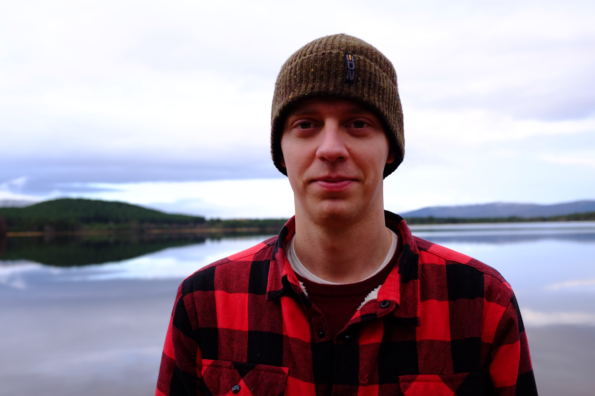

<video src="/video/loch_morlich.mp4" poster="/video/loch_morlich.png" autoplay loop>
</video>

Esőt ígértek, de Aviemore-ból kifelé még tiszta az idő. Előttünk a Lairig Ghru hágó, de novemberben talán túl nagy falat lenne. Helyette a Morlich tó felé vesszük az irányt, a Glenmore erdőn át.

A skót időjárást ismerve nagyobb mázlink nem is lehetne — 0 fok éjszaka, semmi eső, csak egy pár szem hódara kopog este a sátortetőn.

Fél hatkor már teljesen sötét van, és túl hideg ahhoz, hogy a tóparton bandázzunk. Korai fekvés lesz.

__An Lochan Uaine__

Másnap a Meall a’ Bhuachaille-re (810m) vezet az utunk. Ez még nem [munro](https://en.wikipedia.org/wiki/Munro), de a kilátás miatt nem panaszkodhatunk.

Itt van még sok kép: https://photos.app.goo.gl/97SdabNuqX34XEGs9
