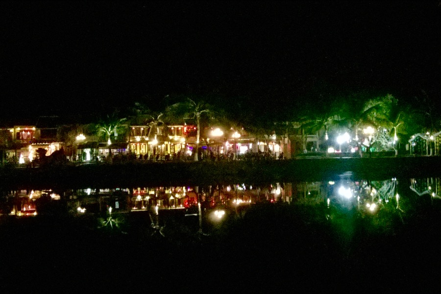
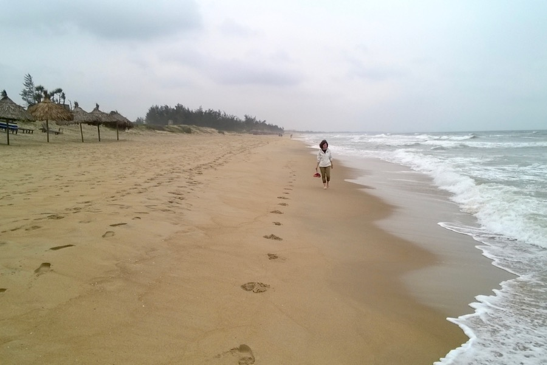
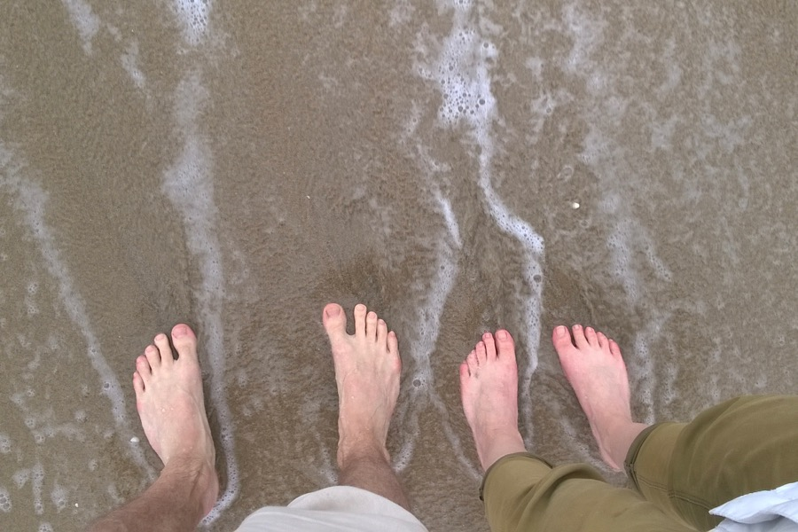
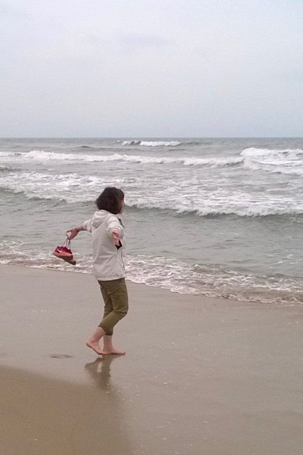

Hoi An egy kisváros közép-Vietnámban, szép sétálóutcákkal, nem messze a tengerparttól. A város gyakorlatilag a turizmusból él. Nagy üzlet a ruhaipar is: itt olcsón lehet jó minőségű öltönyt szabatni. Minket továbbra is leginkább a kirándulás és az evés érdekel.

Ilyeneket ettünk:
- Remek pirított húsos-avokádós szendvics
- Rákos lángos
- Mogyorókrémes, csirkés, szójaszószos csípős szendvics ("banh mi")
- Kacsemelles leves sült vérrel és csípős szósszal.

Délután lebicajoztunk a tengerpartra, és a strandon szerencsére nem volt tömeg. Útközben láttunk vízibivalyokat is.

Alkudni jó dolog: itt Hoi Anban eléggé turistás árak vannak, de 30-40%-ot általában sikerül lebeszélni, főleg, mert alacsony szezon van.

