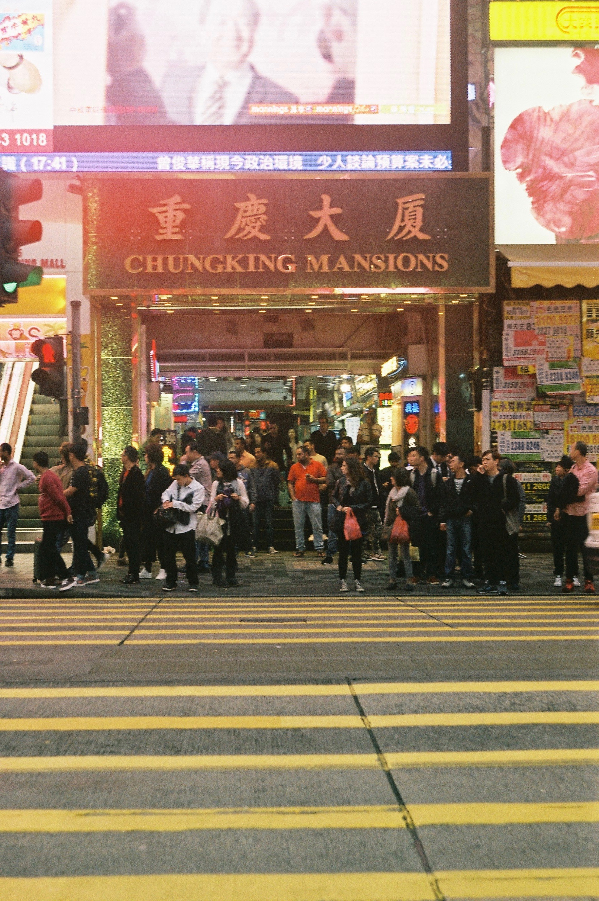
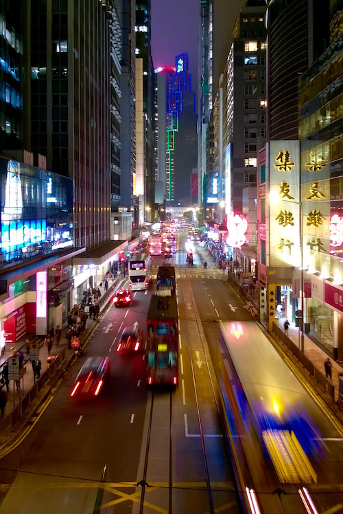

<video src="/video/hk.mp4" poster="/video/hk.png" autoplay loop>
</video>

Hong Kongban párás, fülledt meleg van, meg étcsokoládés Kit Kat, és az utcán legalább nyolcféle nyelvet hall az ember fél óra alatt (pl. kantoni, mandarin, angol, arab, hindi, spanyol, német, francia).

A "lakásunk" legalább 7 négyzetméteres a fürdővel együtt, és Wong Kar Wai filmeket idéző helyen lakunk — olyannyira, hogy a [Chungking Expressz](https://hu.wikipedia.org/wiki/Csungking_expressz) címadó [épülete](https://en.wikipedia.org/wiki/Chungking_Mansions) a szembeszomszédunk. Ez valami nagyon egyedi hely — ha a Nyugati aluljáró épület lenne, így lehetne elképzelni. De annál mégis barátságosabb. A szűk árkádokban curry, kebab, pizza illata terjeng, nagytestű afrikai férfiak italoznak és dohányoznak műanyagszékeken.

Délután a Lamma szigetre mentünk át komppal — ez egy csupa zöld kis sziget, a Hong Kongiak kedvelt hétvégi kirándulóhelye. A túra után friss kókuszlevet ittunk, majd miután egy sziklán sikerült feltörni, a kókusz belsejét is megettük (egész ügyes majmok lennénk).

