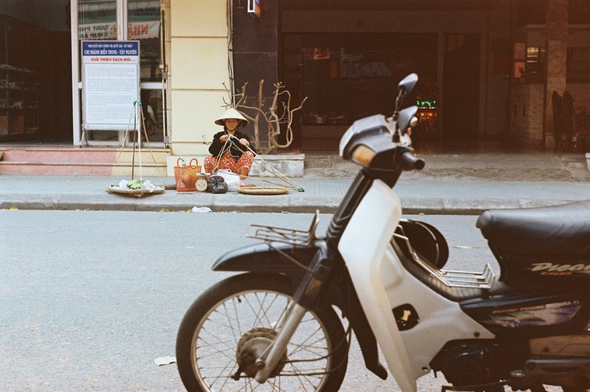
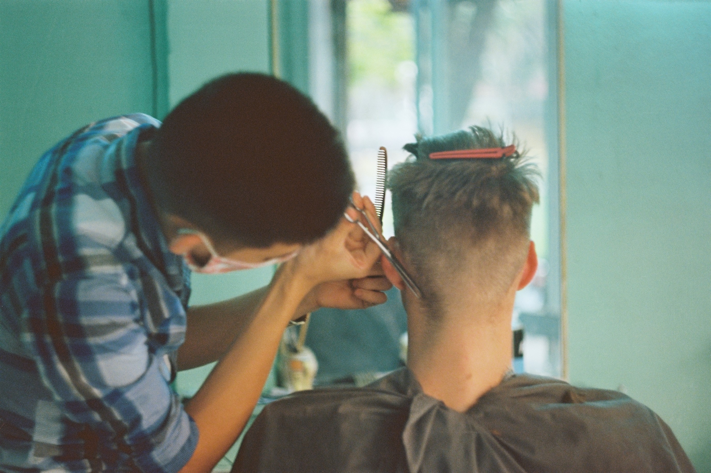

Vietnámban a saigoni feketekávét jéggel és sűrített tejjel tálalják üvegpohárban. Ez itt a kedvenc italunk. Ma egy folyóparti kis kávézóban kértünk ilyet, ahonnan gyerekméretű műanyagszékekben ülve nézhettük a folyami forgalmat.

A szárazföldi forgalom szinte kizárólag robogósokból áll. Ezen az áradaton átmenni egyetlen módszerrel lehet: lassan, folyamatosan haladva — a hömpölyeg szépen kikerül. Eleinte félelmetes, de meglepően jól működik.

Az utcai kaja szenzációs, és a sör is kiváló. Ma szó szerint betévedtünk egy piacra, ahol remek reggeli csíralevest ettünk (legalábbis a csíra volt az egyetlen, ami ismerős volt belőle).

Samu fodrásznál is volt.

Holnap biciklitúrára megyünk, az eső esni fog, de 25 fokban ez nem igazán zavar minket.
