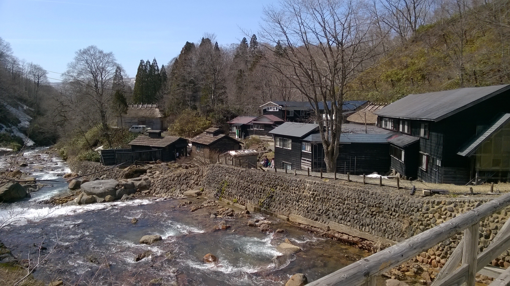
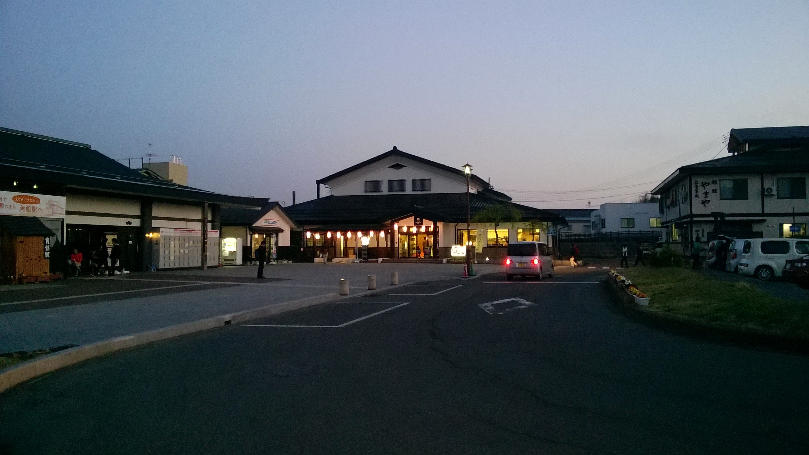
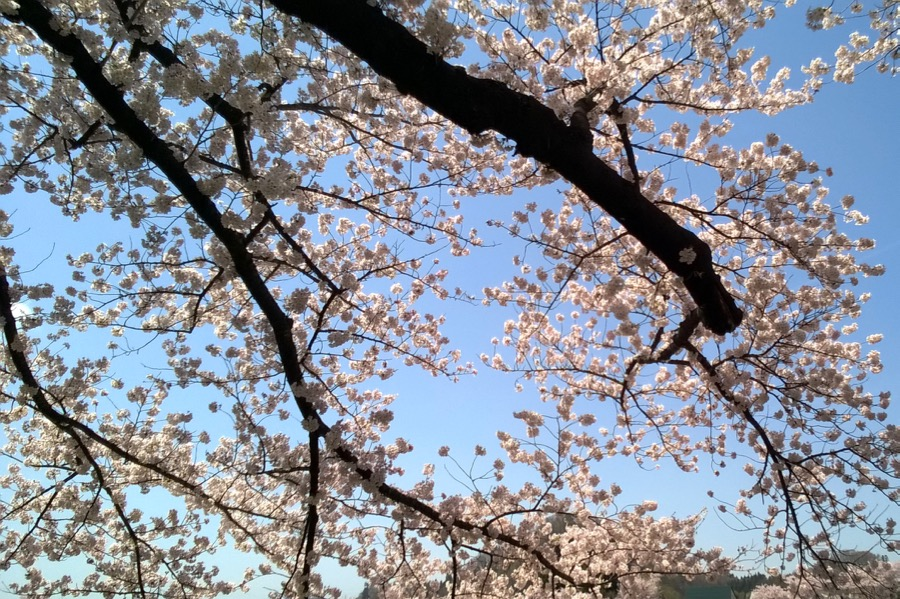
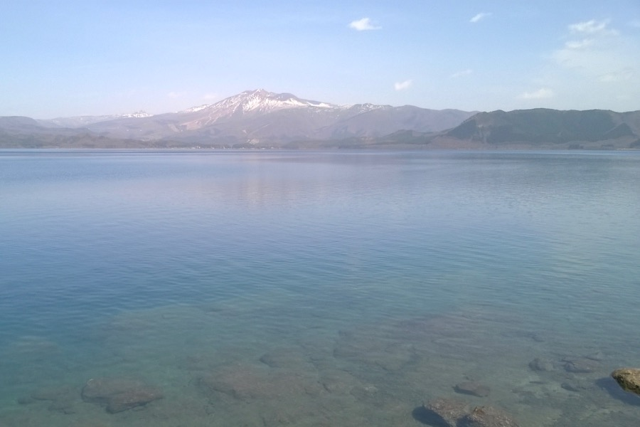

Utolsó japán kirándulásunk is szuper volt, köszönjük Yoshinak az életre szóló élményt!

Volt benne cseresznyevirágzás, futás havas hegyeken, természetes termálfürdő sziklák között, és Japán legmélyebb tava (423 m).

Mindez 590 km-re Tokiótól, ami a 296 km/órával száguldó Shinkansennek köszönhetően egy napba is belefért.

