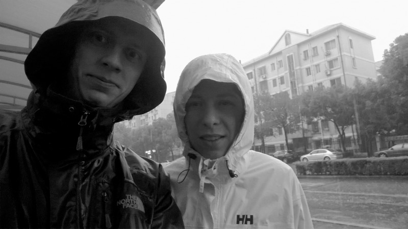

Nagyon izgatottak vagyunk — holnap egy közeli városba, Suzhouba megyünk egy lány meghívására, akivel Nanjing felé találkoztunk a vonaton. Sokat próbáltunk beszélgetni, és meghívott a családjához. A lány angol szakos, bár ez nem sokat segít a kommunikációban. Majd szépen mosolygunk és használjuk azt a pár mondatot, amit tudunk kínaiul.

### Napi nyelvészet rovatunkban világmárkák:
- 乐高 LEGO — boldog nagyon
- 宜家 IKEA — kényelmes otthon
- 可口可乐 Coca Cola — finom szórakoztató
- 苹果电脑 Apple — alma számítógép
- 宝马 BMW — értékes ló.

### Ráadás:
- 雪花 — hó + virág, azaz hópehely
- 加油 — szó szerint “olajat adni hozzá”, például ételhez. Átvitt értelemben: “Hajrá, hajrá!” Ezt a futóklubban tanultuk. :)

### Időjárás-jelentés:

