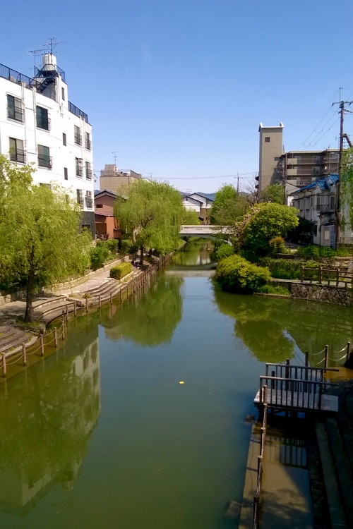
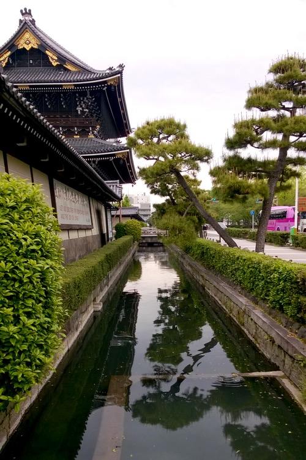
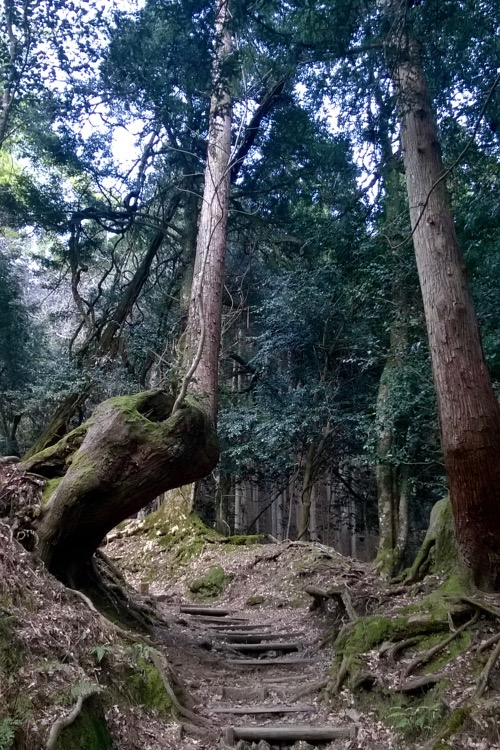
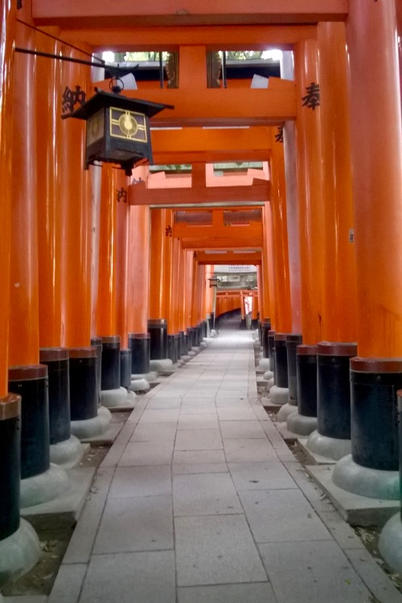
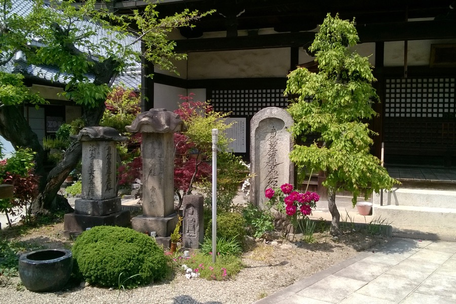
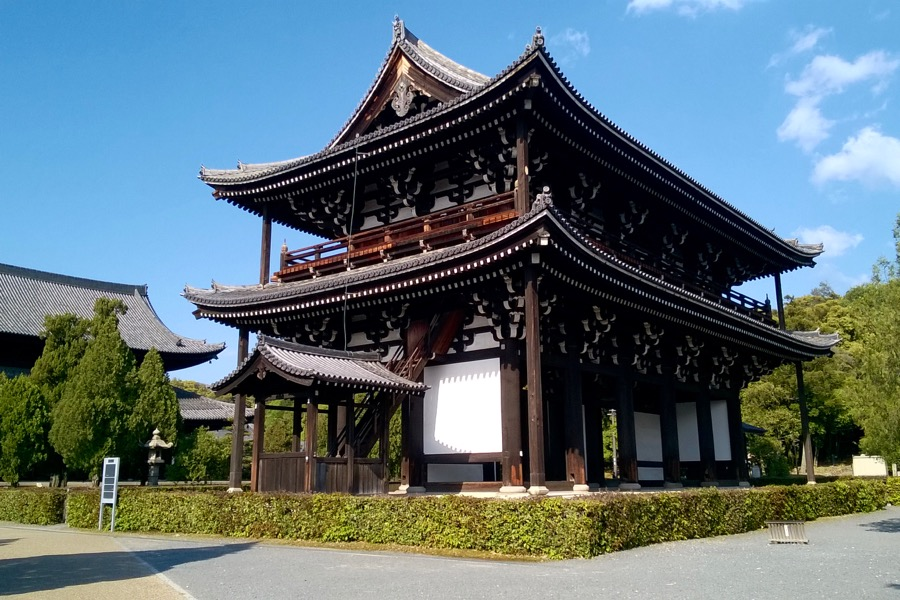
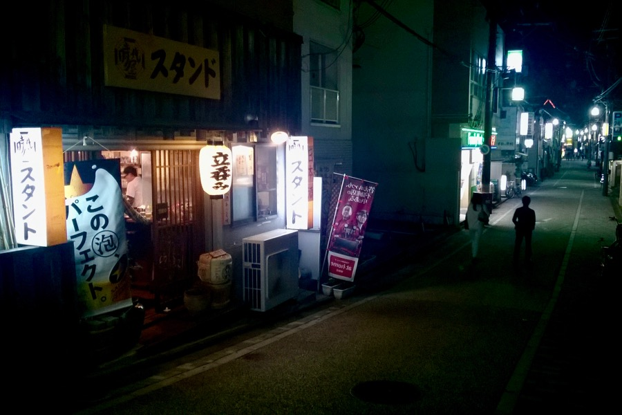

Hétfő reggel Tokióból Shinkansennel utaztunk Kiotóba. A “Hikari” gyorsvonat átlagsebessége 226 km/h megállókkal együtt, a tiszta utazósebesség pedig nagyjából 276 km/h.

Szállásunk Kiotó déli részén, Fushima nevű városrészben fekszik. Metróval és vasúttal is megközelíthető, utóbbira jó a Japan Rail Pass, ezért ezt használjuk. Hosszú bevásárlóutcákon kell végigsétálni (aranyos boltok: élelmiszer, ruha, kézművesáru, papír-írószer, italbolt, minden van).

Egy patak mellett áll a házunk, a Teradaya (történelmi hátterű) fogadóval szemben. A szobánk a negyedik szinten (harmadik emeleten) helyezkedik el, a folyosó végén jobbra. Van saját fürdőszobánk és egy icipici konyhánk is, ami mosogatóból, egy kis konyhapultból, asztalkából és egy vízforralóból áll. Szép nagy ablakunk a patakpartra és a túloldalt lévő házakra és fákra nyílik. Ágyunk borítása tatamira emlékeztet.

A szállásunktól nem messze (15 perc sétára) van egy parkerdő, gyönyörű nagy fákkal — cédrusokkal és ciprusfélékkel — és egy hatalmas kőlépcsővel — itt futottunk reggelente. Mivel a vasút kényelmes távolságra van, kirándulni is jó innen. Kedden például Narába és Inariba mentünk.

A turistákkal tömött Inari-hegy megmászása után Kiotó egyik szép külvárosába ereszkedtünk le. Rendezett, elegáns házak: tehetős környék, mégsincs benne semmi hivalkodó. Az Inari-hegyre másnap hajnalban is felfutottunk, a korai óra miatt ezúttal gyakorlatilag kihalt volt, csak néhány imádkozó, a hegyi Rókaistennek tiszteletét tevő japán öregúrral találkoztunk.

Kiotói étkezésünk pompás volt. Első nap találtunk egy curry-s helyet, ahol indiai zene szólt, és kedves, halkszavú, de mindig figyelmes pincérfiú szolgálta fel az ételt: kitűnő salátát és levest, majd egy nagy, köralakú fémtálcán hatalmas lepényt (naan-t), paprikás-fűszeres csirkét (chicken tikka-t) és csinos kis fémedényekben sáfrányos rizst és szószokat (báránysülteset, rákosat, egyebeset). Hozzá kellően hűs, a csípős ízeket finomító mango lassit ittunk. A földön ültünk, párnán, törükülésben. Terülj-terülj asztalkám volt, megfizethető áron - ide később még visszatértünk egy ebédre.

Esténként rendszerint Family Mart-ban vásárolt sushit, sashimit, kitűnő instant tésztát (ramen-t) és helyi, Grand Kirin nevű kézműves sört fogyasztottunk az ideiglenes lakásunk asztalkáján. Tejes zöldteát (“matcha latte”) vagy Nescafé-t ittunk.

Egyik esti felfedezősétánk során olyan érzésünk volt, mintha a sok tiszta, rendezett és csendes utca mind csak díszlet lenne egy filmforgatáson. Játékos Tesz-Vesz városnak tűnik, ahol minden jól szervezett, és mindenkinek megvan a maga feladata.

Elsétáltunk egy italkimérő mellett, amit első pillantásra nehezen ismertünk fel annak, majd a 日本酒 felirat segített: “japán szesz”. Ennek hatására egy kicsit eltöprengtünk, igyunk-e itt egy sört, majd japán szórakozóhelyekről olvasott rémtörténet jutott eszünkbe, miszerint egy biztonsági őr “Sorry, Japanese only” mondattal tessékelte tovább a külföldieket. De félelmünk alaptalan volt, mert a bent fogyasztó bácsi (láthatóan törzsvendég), meglátva tétovázásunkat, kikiáltott nekünk: “Welcome, welcome!”.

Beléptünk, mosolyogva köszöntünk, és sört kértünk a fiatal pultos sráctól. Egy harmadik, rendezett öltözetű úr, akinek szavát eddig nem hallottuk, és aki szerényebben húzódott meg a bárpultnál, felugrott, és székeket hozott nekünk - furcsa, sörösrekeszre emélkeztető, de annál magasabb üléseket. A mögöttünk lévő asztalnál ülő vendégek sorkorcsolyát kértek: csapos barátunk apró virsliket kezdett kisütni. Csevegtünk, söröztünk, majd egy fél óra után hazaindultunk.