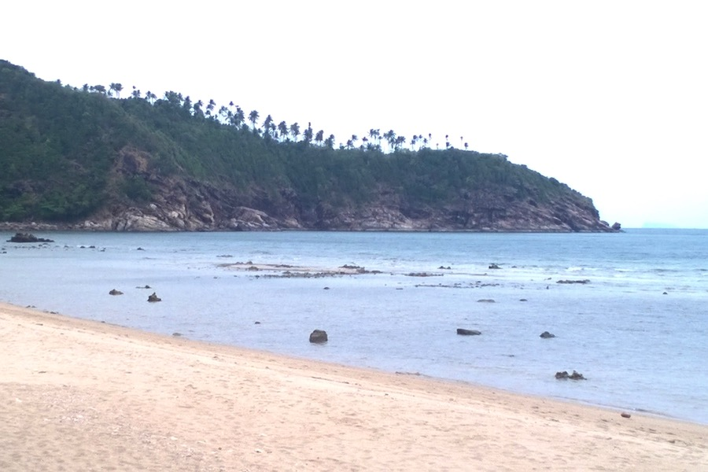
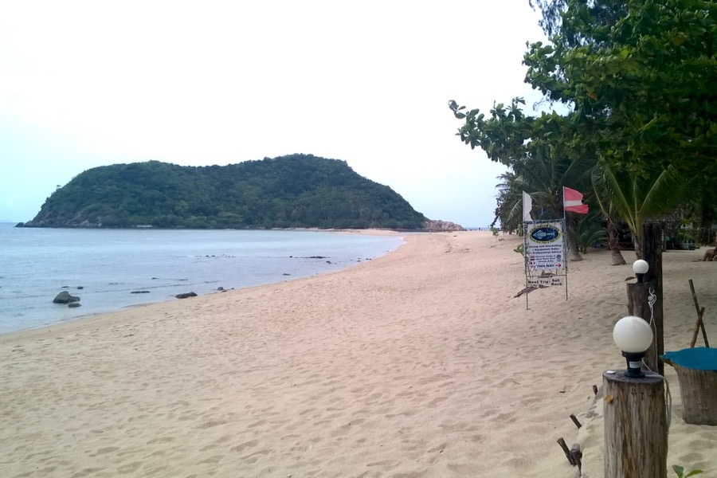
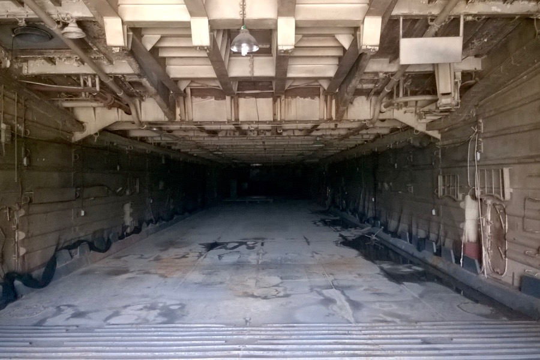
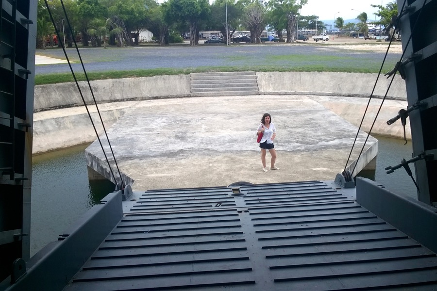

Tegnap korán keltünk és Phangan szigetére kirándultunk. Ez egy csendesebb hely, mint a mi lakhelyünk, és nagy része nemzeti park. A sziget északnyugati csücskén szemeltünk ki egy szép strandot, és ott töltöttük a napot.

 

Benéztünk egy kiszuperált hadihajó hasába is, Thaiföld Amerikától kapta ezt a hajót a vietnámi háború idején.

Hazafele még éppen maradt elég pénzünk ebédre. Egy utcai árusnál vettünk különböző rablóhúsokat, amiket állva befaltunk.
