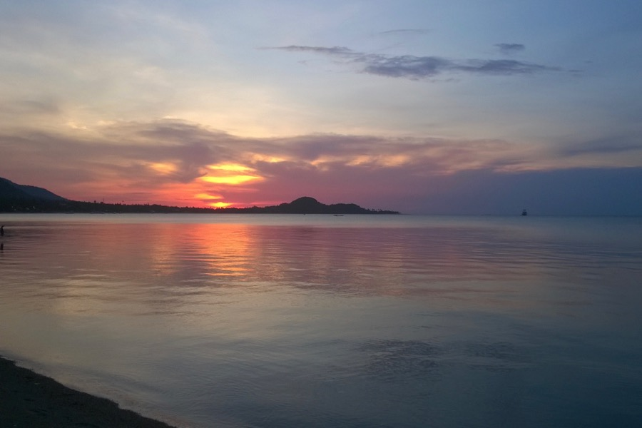

Megérkeztünk a szezonon kívül Siófokra emlékeztető Ko Samuira. Felkapott és kissé lehasznált hely, de a következő három-négy hétre tökéletes lesz. Itt lesz a főhadiszállásunk, de bejárjuk a környező szigeteket is (Ko Tao, Ko Taen, Ko Phangan). A tenger kiábrándítóan meleg: 31.7 fok, ami nem frissítő, szóval a fürdést nem visszük túlzásba.

A naplemente megtekintése mindennapos programunk. A negyed hétkor feltűnő pasztellek (len, nefelejcs, levendula) 18.35 körül mélyebb színekbe mennek át (cinóber, burgundi vörös, kármin).

Írjatok emaileket, mert hiányoztok.
