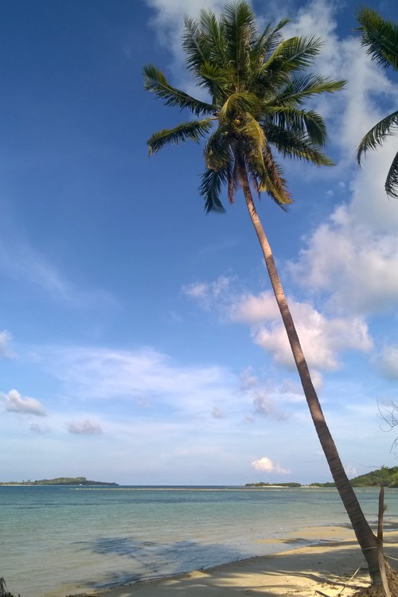
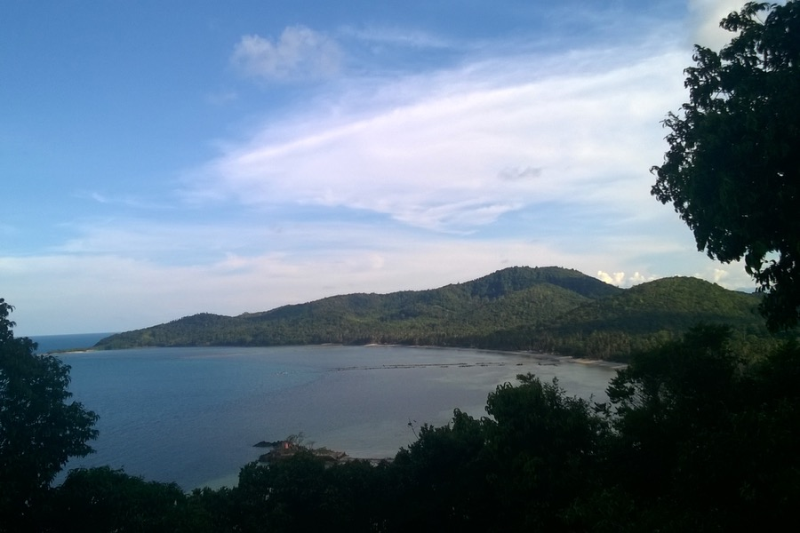

A hétvégét egy majdnem lakatlan szigeten töltöttük. A Wikipédia szerint 20-30 ember él Ko Tan-on. Előre kiszemeltük ezt a szigetet. Az interneten nem lehetett szállást és közlekedési módot találni, de mi megkértük az egyik kirándulócsónak üzemeltetőjét, hogy tegyen ki a szigeten, és hagyjon ott egy napra. Így is lett. Bungalót béreltünk a tengerparton.

A szigeten sétálva hatalmas bivalyokkal találkoztunk, de szerencsére ők jobban féltek tőlünk, mint mi tőlük. Az őserdő hangjai természetfilmbe illőek voltak, egzotikus madarak zsivalya vett körül, és láttunk termetes gyíkokat is.

__A strandon éjszaka ugrándozó nyuszikat nem tudtuk mire vélni.__ A hold fénye pedig olyan erős volt éjszaka, mint egy reflektor: a pálmafák árnyéka a homokon kontrasztos, éles határú volt.

Másnap délelőtt elsétáltunk a sziget kevésbé zsúfolt felére, ahol ittunk egy kólát. Vezetékes víz nincs, elektromosság generátorról naponta pár órára van, de kóla, az van.

Délután felvett minket a csónakunk, és folytattuk a búvárkirándulást. Láttunk kékpettyes maszkos ráját, színes korallokat, még színesebb halakat. Fáradtan és éhesen értünk haza.

