Június másodikától Európában folytatjuk, ezért az ázsiai blogunkat itt befejezzük. Ha megint Keletre megyünk, szólunk.

Utaztunk repülővel, autóval, taxival, songthaew-val (pick-up taxi), robogó-taxival, busszal, vonattal, shinkansennel, motorral, kerékpárral, elefántháton, metróval, emeletes villamossal, komppal, hajóval, motorcsónakkal és gyalog.

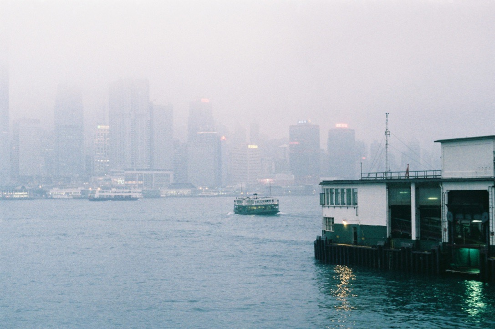
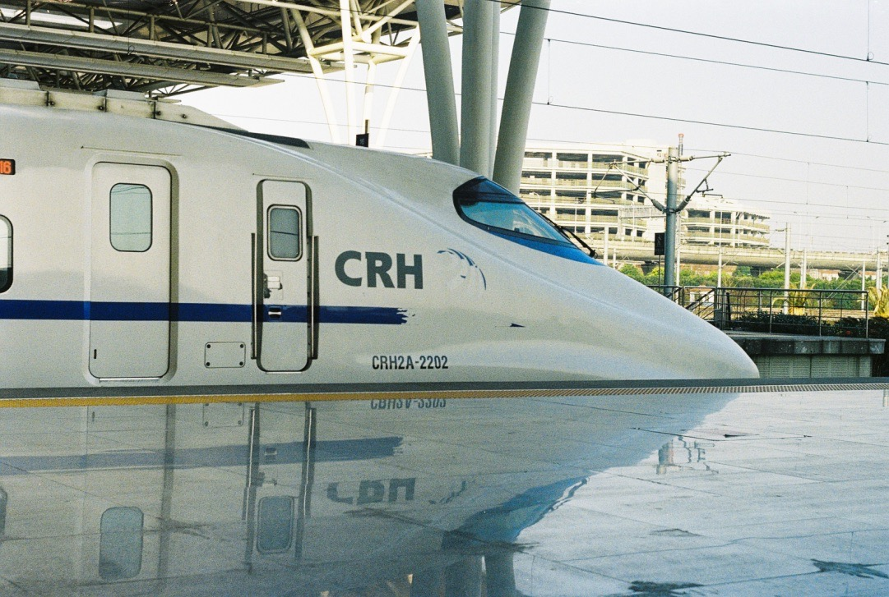

Jártunk királyságban, kommunista országban, különleges igazgatású területen, a legtöbb ország által el nem ismert országban (Európában csak a Vatikán ismeri el Tajvant hivatalosan).

Legolcsóbb szállásunk 2.524 Ft volt egy éjszakára (Quy Nhon, Vietnám, a szoba a tengerre nézett), a legdrágább 14.985 Ft (Hong Kong, ablak nélkül, Samu csak hosszában tudott benne kinyújtózni). A legolcsóbb étel 126 Ft-ért egy tartalmas leves vagy egy banh mi (remek szendvics) volt Vietnámban, a relatíve legdrágább egy (igen, egy darab) alma 610 Ft-ért Kyotóban.

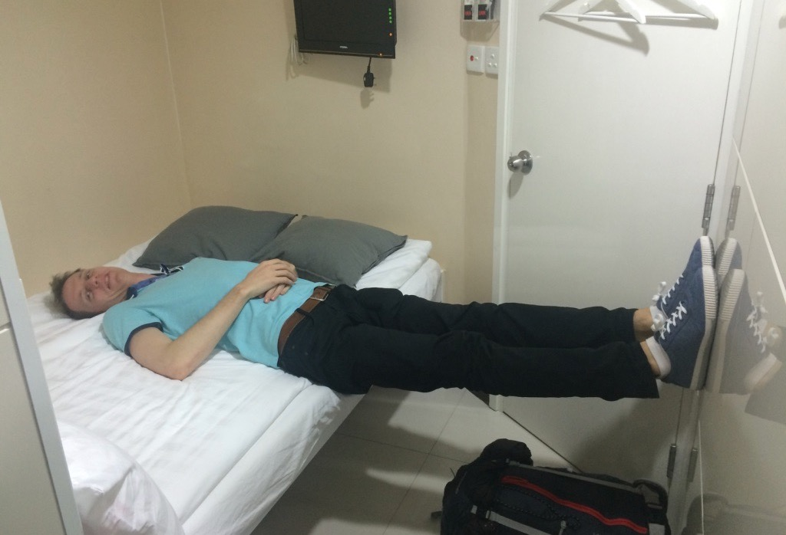
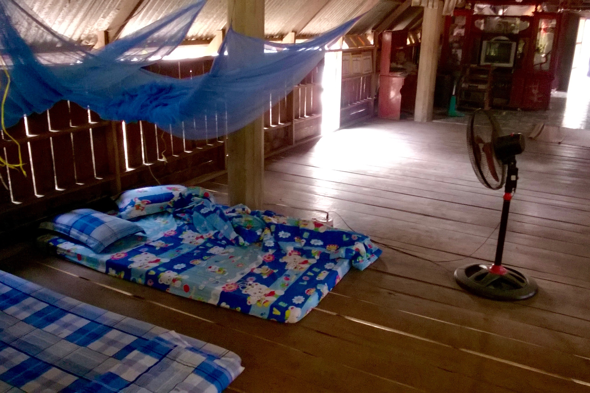

### Mit tanultunk?

__Pakolni__ — A rekord fejenként 8 kiló kézipoggyász összetömörítése 5 kilóba. Soha nem kellett poggyászt feladnunk, általában le se mérték a táskáinkat.

__Pálcikával enni__ — már kényelmesebb így, mint késsel-villával. Könnyű elmosni, nincs fémes hangja, és különben is, ha mindkét kezed tele van, miben tartod a tányért? Gyakorlatilag bármit megeszünk pálcikával, pl. tejberizst lekvárral.

__Alkudni__ — rákos lángost, hotelszobát, biciklikölcsönzést, és még sorolhatnánk.

__Korán kelni__ — Kyotoban a tízezer vörös kapu nagy turistalátványosság, szóval tele van turistákkal. De nem reggel fél hétkor!

__Mosógép nélkül élni__ — fájdalmas, de kibírható. Csapban is lehet nagymosást csapni.

__Kérni, és élni a jogainkkal__ — pl. nem volt ottalvós kirándulás Ko Tan szigetre, de megkérdeztük, hogy lehet-e, és lehetett. Aztán Saigonban minden este küzdelem volt bejutni a szállásunkra, így visszakértük a pénzünket. Visszakaptuk.

__Hogy mi fontos nekünk a hétköznapokban:__
- Jóízű, tiszta ivóvíz a csapból.
- Kenyér. Nem az a cukros-édes kalácsféleség, ami Ázsiában van.
- Természet elérhető távolságban. Otthon a Gellért-hegy van közel, de egy óra utazással akár a Börzsönyben is kirándulhatunk.
- A környezetünk tisztasága. Tiszta levegő, tiszta utcák. Fizikai megkönnyebbülés volt Japánba (és Európába) érkezni emiatt.
- Hatékony tömegközlekedés. Hogy ne a hatalmas Lexus (Shanghai) vagy a csúf és hangos robogó (Vietnam, Thaiföld) legyen a legnépszerűbb közlekedési eszköz.
- Séta. A legtöbb helyen meglepően nehéz volt egy szimpla séta kivitelezése. Kínában fellöknek a köpködő-harákoló, dohányzó emberek, Vietnámban és Tajvanon robogók sora parkol a járdán, Thaiföldön nincs járda és nem lehet két szót váltani anélkül, hogy a taxisok dudálnának nekünk (kösz, nem akarunk menni sehova), vagy étteremből hellóznának (kösz, nem megyünk olyan étterembe, ahonnan kikiabálnak nekünk).
- Az emberek, akikkel nap mint nap találkozunk. A “törzs”, amiben otthon élünk. Az otthon adottnak tűnő dolgok, mint összefutni valakivel egy kávéra vagy ebédre, beszélgetni egy pohár sör vagy bor mellett.
- Visszajelzés a munkánkkal vagy mással kapcsolatban.
- Kávé — és nem csak a kitünő olasz eszpresszó, hanem egy sima Nescafé is.

### Kedvenc tárgyaink a hátizsákból
- __Kindle__ — sokkal több időnk volt olvasni, mint általában, és hosszú útra egyébként sem lehet elég könyvet vinni. Életmentő volt, amikor három napig nem volt internet és egy napig áram sem.
- __Merinó gyapjú ruhák__ — ezek használódtak el a legkevésbé, hetek után sem büdösödnek, csak egy kicsit szellőztetni kell őket.
- __Szappan__ — általában kaptunk, de amikor nem, akkor nagyon jól jött.
- __Futócipő__ — futni, gyalogolni, kirándulni. Futottunk is 280 km-t február közepe óta.

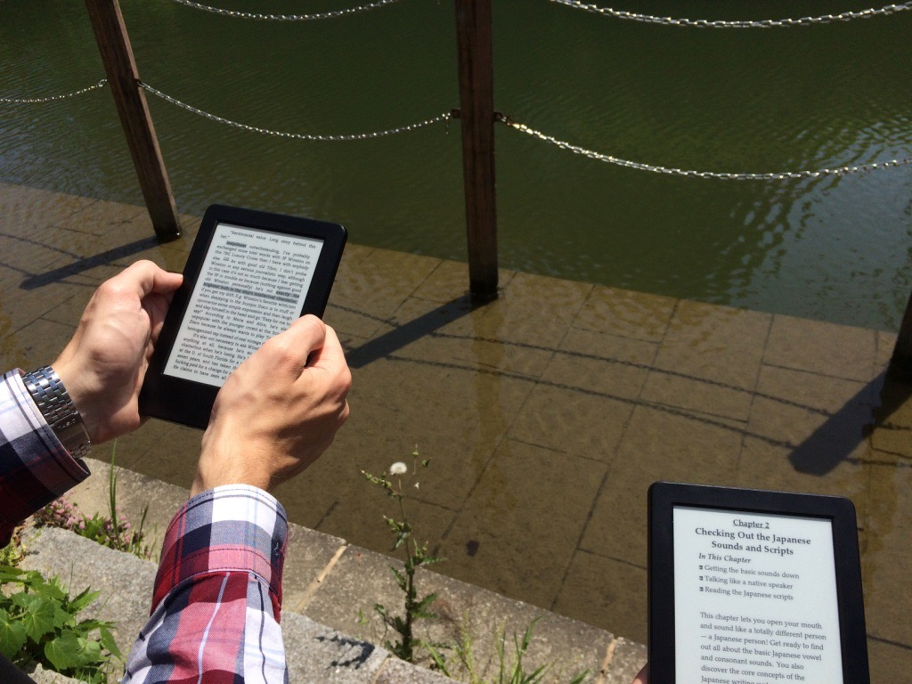

### Dolgok, amiket azonnal importálnánk Európába
- Shinkansen (Japán)
- Meleg dobozos kávét áruló automata (Japán)
- Tajvanról a legjobb dolog, ami egy csirkével történhet (ld. ételek)

### A legjobb dolgok és helyek
- JAPÁN!!! Japánban minden érdekes volt. Atami, az onsen (termálfürdő) Shinano-Kizakiban, és hogy az egész ország úgy néz ki, mint valami Tesz-Vesz Város.
- Motoros túra Vietnámban
- Sok sportolás Taipeiben (futópályák és 50m-es uszodák mindenhol), és azok az omlós csirkék… mmm…

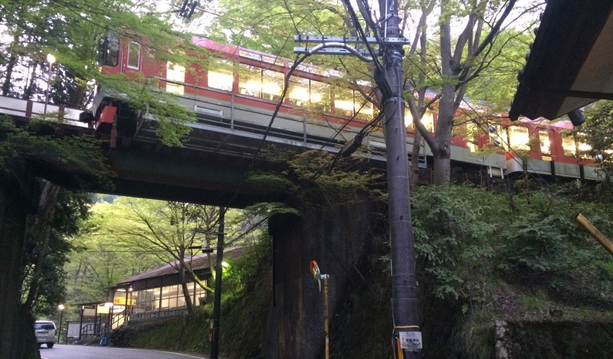
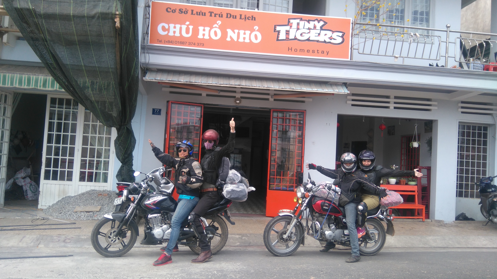

### A legjobb ételek és italok
- Shengjianbao (Shanghai) — hússal és levessel töltött tésztagombóc, amit aranybarnára pirítanak. Vigyázat, belül tűzforró!
- Banh mi (Vietnam) — félbevágott kifli megkenve zsírral, szójaszósszal, csiliszósszal, és megtöltve mindenféle jóval. A patkányok is szeretik!
- Pho leves — forró, csípős, finom.
- Tajvani omlós csirke — a legjobb dolog, ami egy csirkével történhet!
- Kókuszos–paradicsomos, lassú tűzön főtt csirkecomb (mi főztük) — villa hegyével hozzáérve leesik a csontról a hús!
- Lime-os, mogyorós, rákos papajasaláta...mmmm!!
- Vietnami reggeli — nagy adag főtt rizs, négyféle állattal: töltött tintahal, rák, natúrszelet, rántott szelet.
- Vöröstonhal sashimi (nyers hal). Bármilyen más sashimi. Bármilyen sushi.
- Soba (tésztaleves) a peronon Japánban.
- Vietnámi kávé.
- “Kato” márkájú, kókuszhús-darabokkal dúsított gyümölcslevek Thaiföldön.
- Bubble tea, szó szerinti fordításban igazgyöngy tejes tea.
- Mangó, banán, friss kókuszdió.
- Zöld teás csoki, zöld teás fagyi, zöld teás minden (Japán).

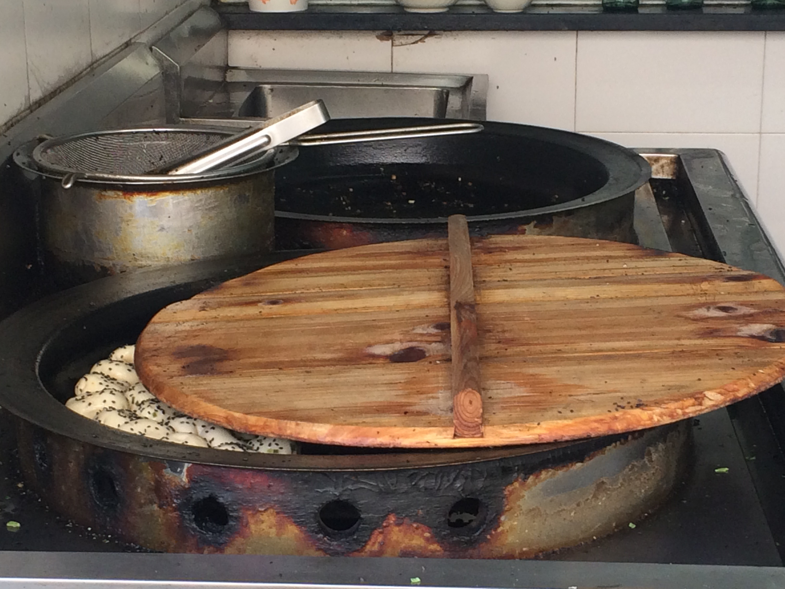
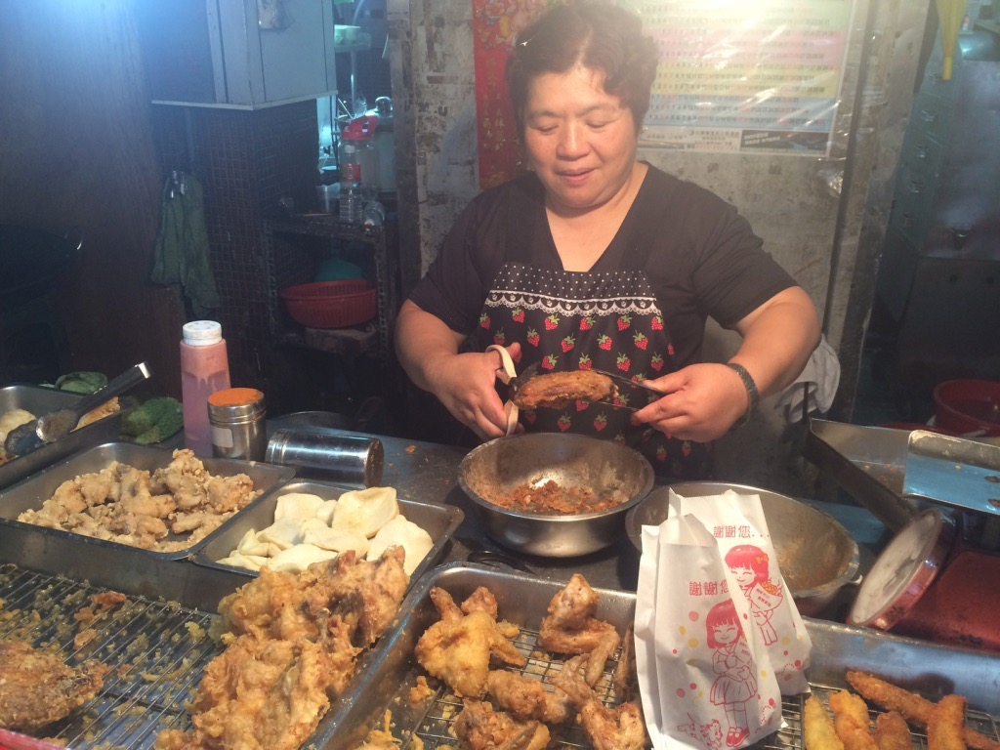
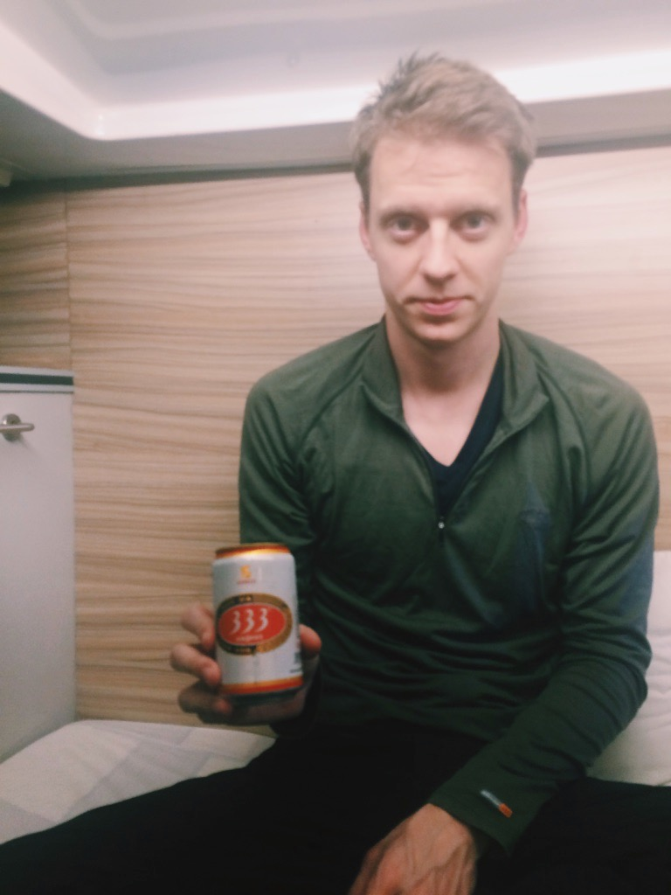
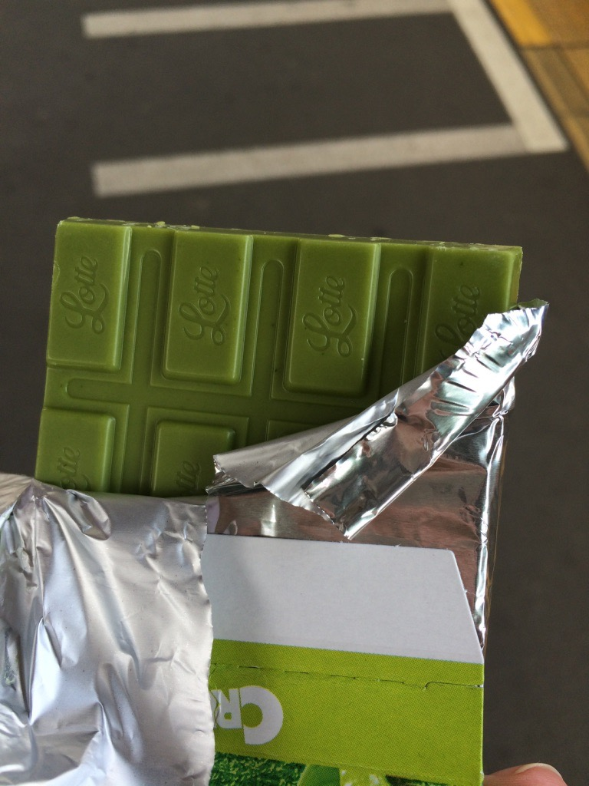

### A "legérdekesebb" ételek és italok
- Natto (Japán): fermentált szójabab mustárral. A mustár javít rajta. (Japánban divat a külföldiektől megkérdezni, hogy tudnak-e natto-t enni. Tudunk, ha muszáj, de inkább nem kérünk.)
- Nagyon szálkás halak és nagyon csontos húsok Kínában. Mi értelme egy ételnek, ha a háromnegyedét nem lehet megenni?
- Elrontott brokkoli (Kínában ilyet is tudnak).
- Kínai “bor”.
- Kínai 2-3%-os “sörök”.
- Automatás szaké Japánban. (Jó, mondjuk automatából szakét venni…)
- “Medúzaleves” Vietnámban. Nem tudjuk, hogy a medúzaszerű dolog mi volt benne, de lehet, hogy tényleg medúza.
- Medvecukorral fűszerezett sült rizs Kínában, fúj!
- Sörnek kinéző higított rizspálinka Thaiföldön. Azt hittük, hogy sör! Elég nagy csalódás volt (rosszabb volt, mint a japán automatás szaké). Gyorsan ki is dobtuk.
- Általában az édességek.
- Angolnalárvának kinéző hal Japánban (lehet, hogy nem angolna). De ez nem volt rossz, csak érdekes.

Jó volt a térkép másik szélén kalandozni egy kicsit.

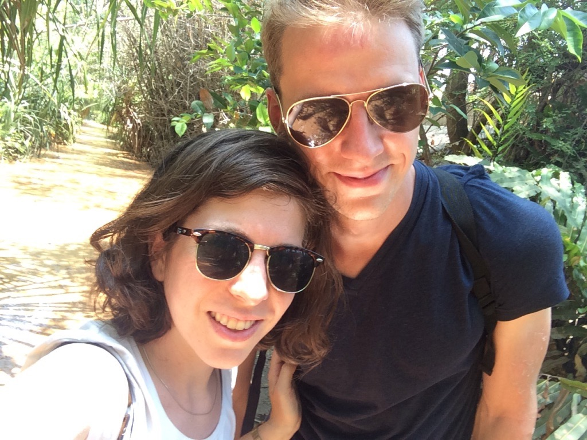
