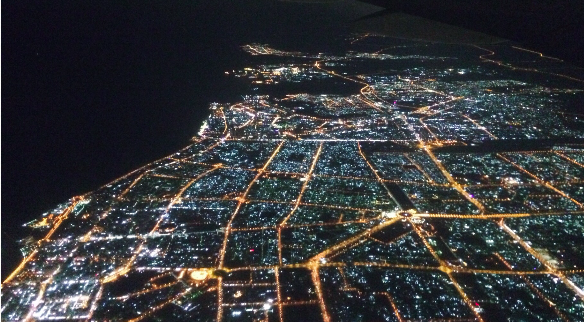

Megérkeztünk egyben.

Az útról röviden:  
- a budapesti reptéren ki van rakva egy zongora, amin bárki játszhat
- az Emirates tök jó légitársaság
- 11 km magasan kaliforniai merlot-t inni jó
- fejenként 8 kiló cuccal utazni nagyon felszabadító érzés (és erről majd írunk bővebben)
- utaztunk a világ legnagyobb utasszállítójával (Airbus A380)
- a negatívjainkat minden reptéren hajlandóak voltak manuálisan átnézni, így nem kellett szegényeket röntgenezni
- a Shanghai-i reptérről [maglevvel](https://hu.wikipedia.org/wiki/Sanghaji_lebegő_mágnesvasút) jöttünk be a városba, 8 perc alatt tette meg a 35 km-es távot, elég menő!

Ez Dubai:  

És hogy ne hiányozzunk nagyon: *...én sejkem, kik utaznak az első osztályon...*
