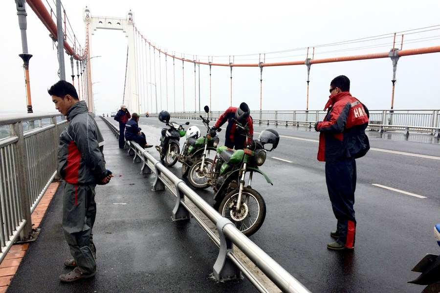
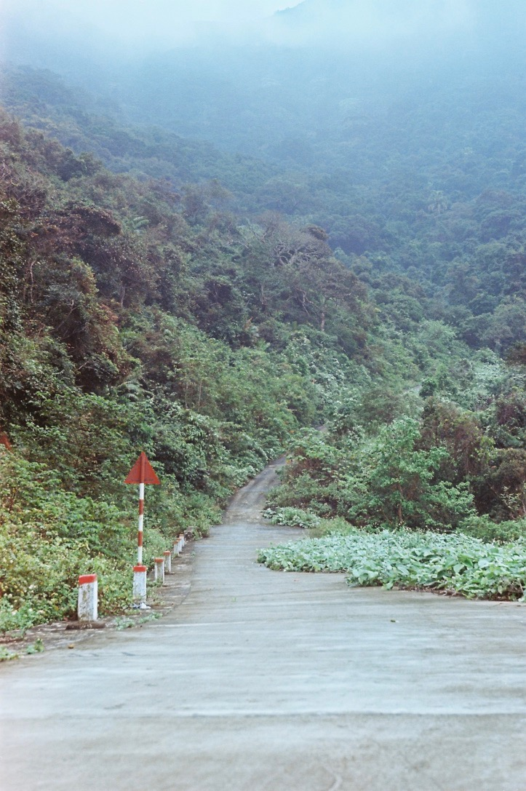
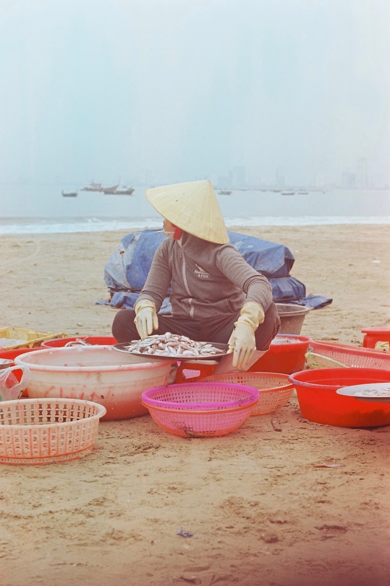
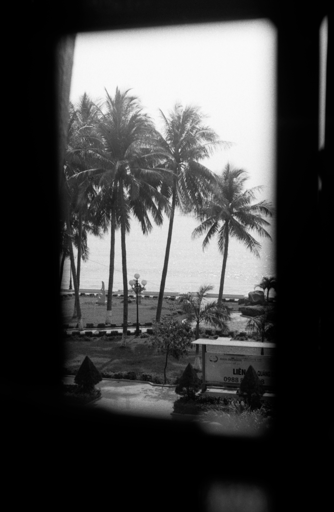
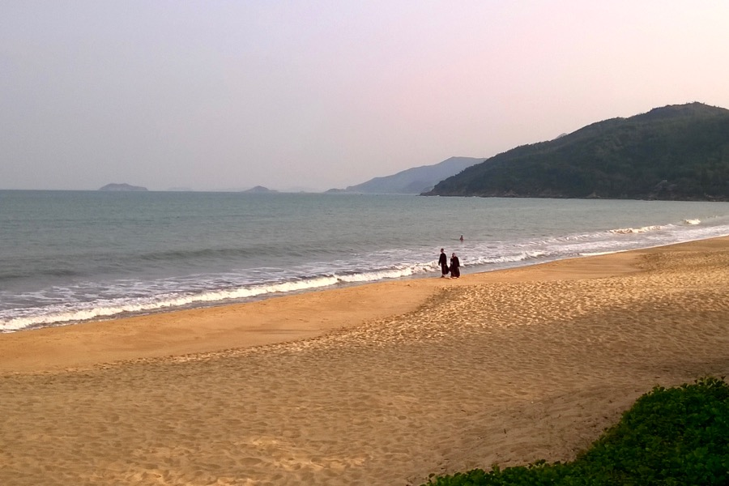
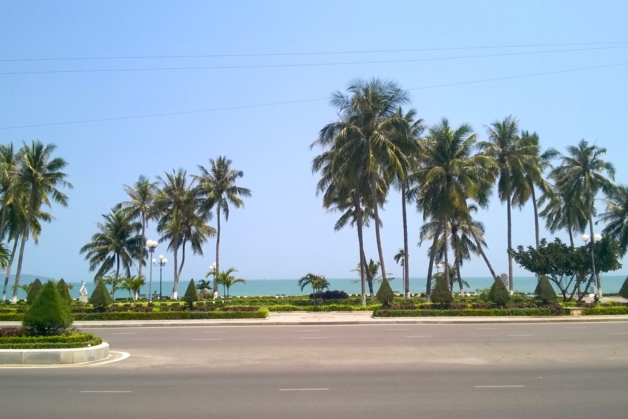
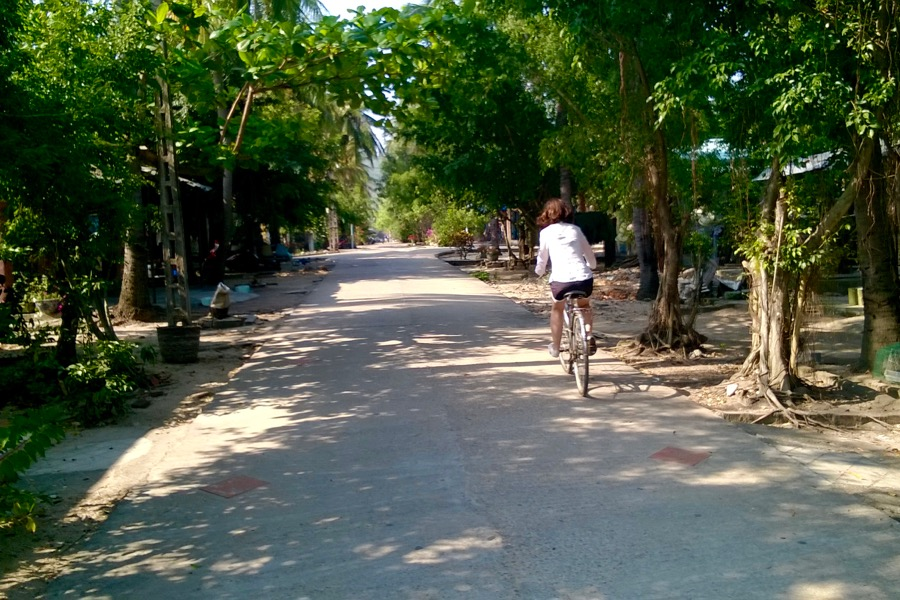

Na jó, bevalljuk: voltunk egy egész napos motoros túrán. Közelebbről megismerhettük a vidéki Vietnámot (elárasztott rizsföldek, vízibivalyok, földművesek).

Kanyargós utakon vittek fel minket a ködös hegyekbe, ahol többféle majmot is láttunk fáról fára ugrálni. Minden percét élveztük.

Felfedeztünk a tengerparton egy kisvárost, ahol nincsenek turisták, csak kézzel-lábbal tudunk kommunikálni, és a szálláshelyünkre annyi sincs kiírva angolul, hogy _hotel_. Quy Nhon nagyon nyugodt hely, a szobánk a tengerre néz, és jólesik, hogy egy ásványvizet leszámítva semmit nem akartak még eladni nekünk.

A nappal és a helyiekkel keltünk: ilyenkor még elég hűvös van egy laza futáshoz a homokos tengerparton, és utána jólesik egy tartalmas leves reggel hét körül. Délelőtt sziesztáztunk (fáradtak voltunk, mint a kutyák), aztán biciklit béreltünk. Bár nem oda indultunk, véletlenül betévedtünk egy parkszerű szanatóriumba, ahol leprásokat ápolnak (komoly), és egyébként [benne van az útikönyvben](http://www.lonelyplanet.com/vietnam/quy-nhon/sights/historic/quy-hoa-beach-leper-hospital).

