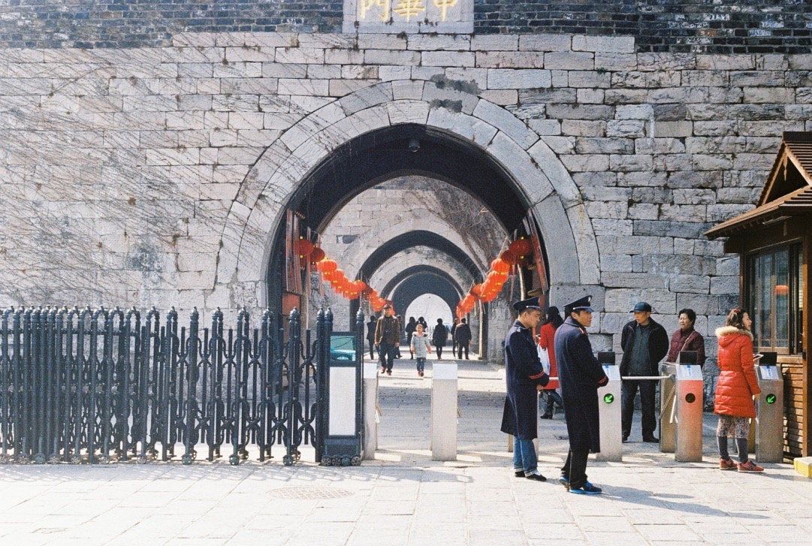
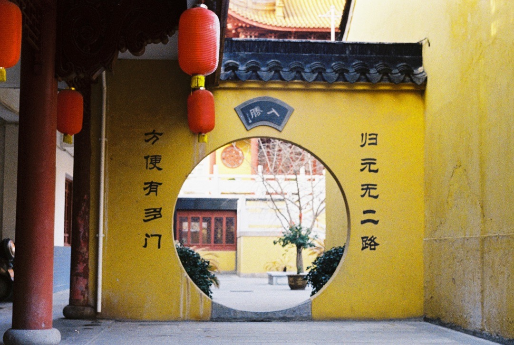
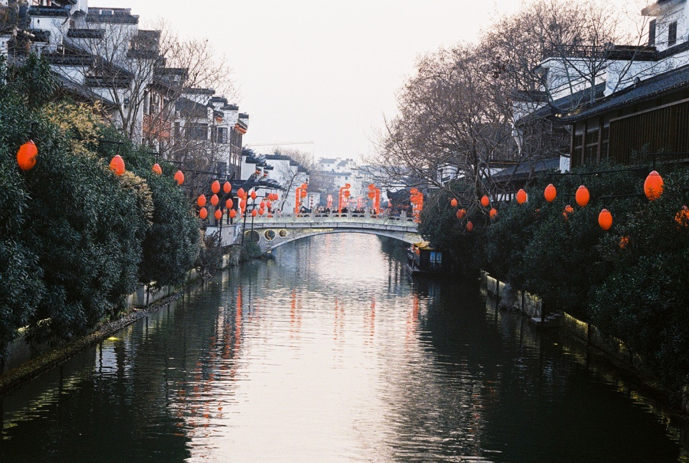

A nanjingi kiruccanásunk mozgalmasan alakult. Korán keltünk és gyorsvonattal (= 300 km/h) utaztunk a “déli fővárosba”. Ehhez kapcsolódik a napi nyelvi érdekesség: nan “南” = dél，jing 京 = főváros. Peking az északi főváros, bei “北”＝ észak. Tokyo, dongjing, 东京，a “keleti főváros”. Nyugati főváros nincs.

Nanjing hatalmas város — zsúfolt sétálóutcák, harákoló-köpködő tömegek. Viszont vannak benne kedvelhető, csendes helyek — ilyen a belvárosi kanális partján fekvő apró teakert, vagy a pagodákkal, pavilonokkal teli park a Xuanwu tó közepén. A tó 444 hektár területű, a 4-es szám pedig balszerencsét hoz a kínaiak szerint, mert kiejtése hasonlít a “halál” szóhoz ([tetrafóbia](https://hu.wikipedia.org/wiki/Tetrafóbia)). Ennek ellenére mi jót sétáltunk és nem esett bajunk.

Ebédre szerencsére baromi jó helyet sikerült találni: egy kis koszos, szűk utcában, egy kis koszos, szűk kifőzdét. Ezek a legjobbak. Egy aranyos néni készített nekünk marhahúsos pirított, főtt rizst, mindenféle zöldséggel és csípős szósszal. Hozzá forró tojáslevest kaptunk, mert az mindenkinek jár, és a levesestál bármennyiszer utántölthető a sarokban lévő nagy kondérból. Egy adagot kértünk kettőnknek, és bőven elég volt. 10 yuan-ba került (430 forint).

<video src="/video/cn_nj_food.mp4" poster="/video/cn_nj_food.png" autoplay loop>
</video>

Éjszakára Airbnb-n foglaltunk szállást a város északi részén. Viszont a szállásadónk nem tudott angolul, így nehezen ment a kommunikáció. SMS-ben írta le (kínaiul válaszolva az egyértelműen angol üzenetünkre), hogy melyik épületet keressük, azon belül melyik lakás az övé, és hogy hol találjuk a kulcsot. Izgalmas volt, de megtaláltuk, és az aznap megtett 31 312 lépés megkönnyítette az alvást.

