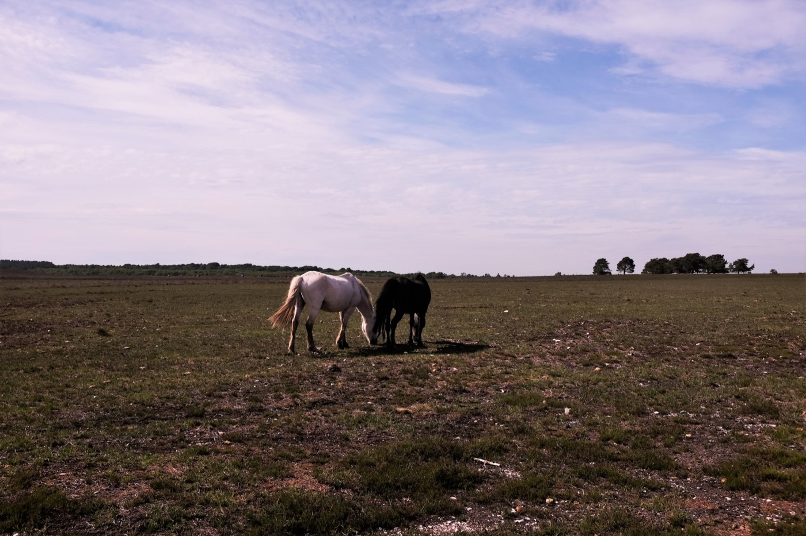
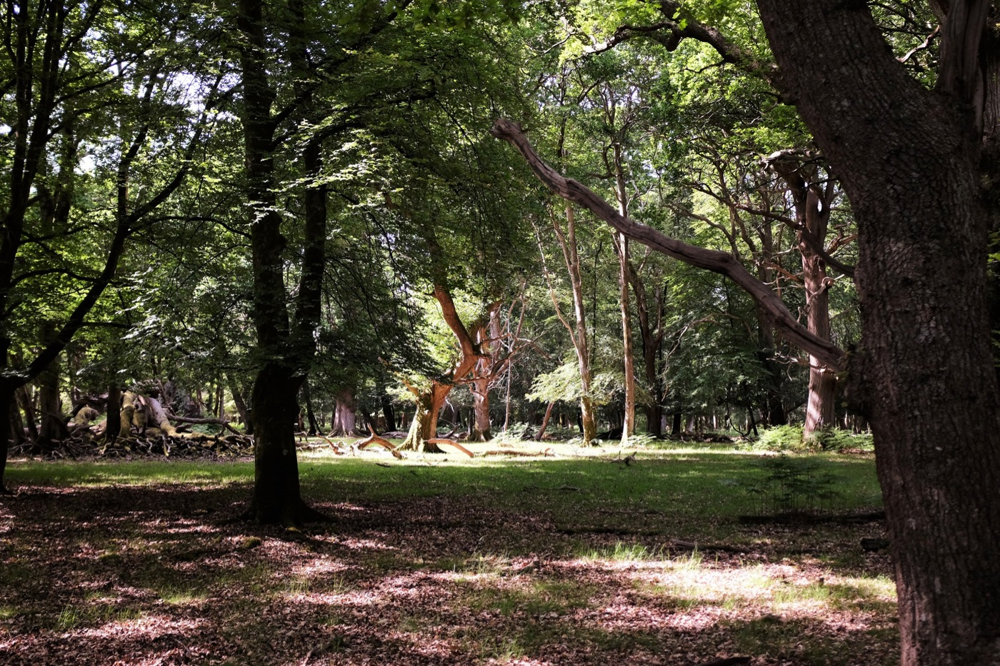
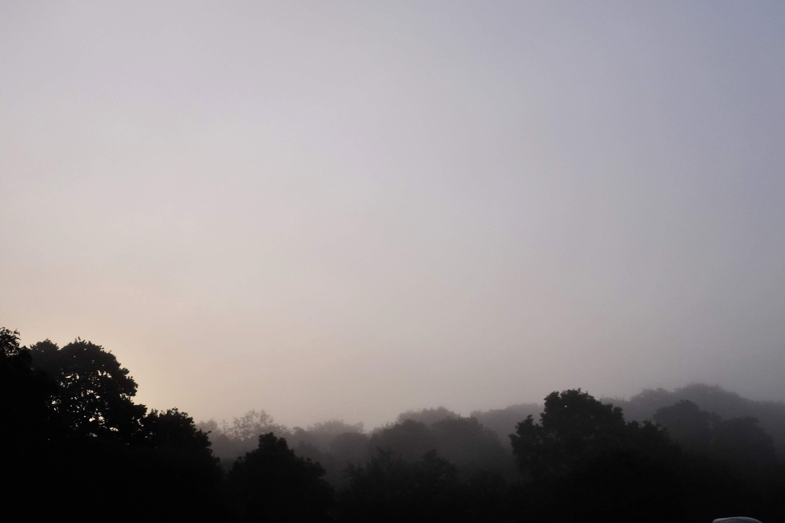

Eláruljuk: ez az Új Erdő nem is annyira új. [Hódító Vilmos](https://hu.wikipedia.org/wiki/I._Vilmos_angol_kir%C3%A1ly)[^1] kezdett el itt vadászni, szóval közel ezer éves. És tele van lovakkal!

A lovak fajtájuk szerint [New Forest pónik](http://www.new-forest-national-park.com/new-forest-pony.html), és __nem vadlovak__, csak szabadon mászkálhatnak kedvükre egész évben.

Skóciával ellentétben a vadkempingezés Angliában illegális. Ez nem azt jelenti, hogy valaki járőrözik éjszaka és osztogatja a büntetéseket, de ha amúgy is kemping kemping hátán, akkor igazán illetlenség lenne vadkempingezni.

Ahol megszálltunk, ilyen volt reggel a kilátás:

[^1]: Ajánlott olvasmány: [Simon Jenkins: __A Short History of England__](https://www.theguardian.com/books/2011/sep/08/short-history-england-simon-jenkins-review)
