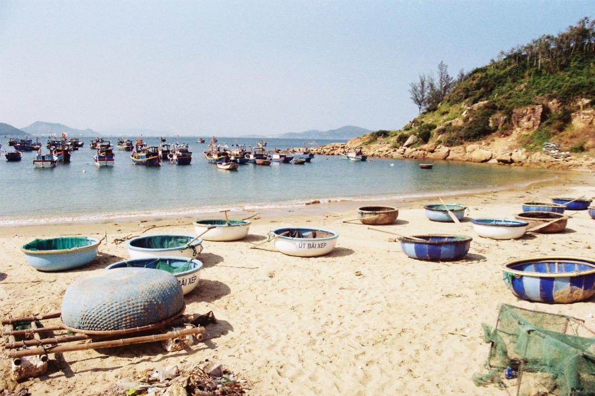
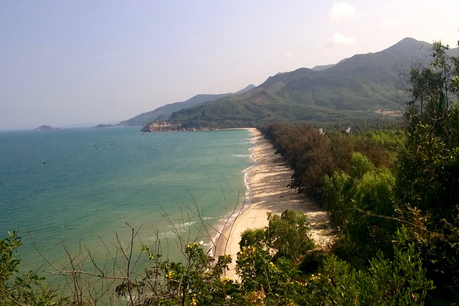
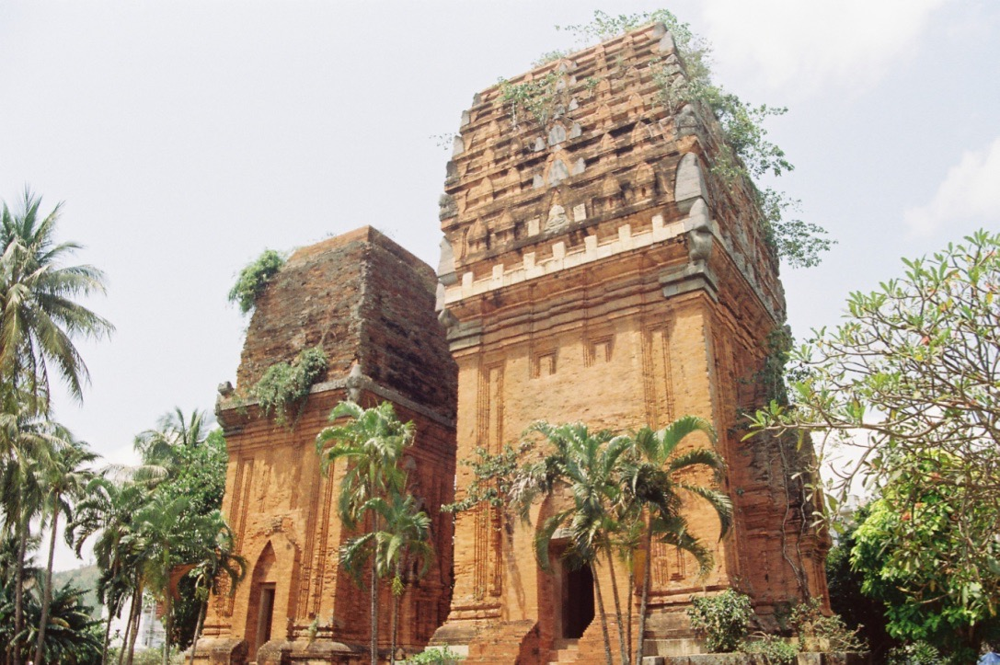

A Dél-kínai-tenger átlagos vízfelszíni sótartalma 33 g/l, szemben a Földközi-tenger 38 g/literével, így a fürdés utáni bőrszárazság és viszketés itt enyhébben érződik.

[Cham](https://www.britannica.com/place/Champa-ancient-kingdom-Indochina) templom Quy Nhon-ban

 
