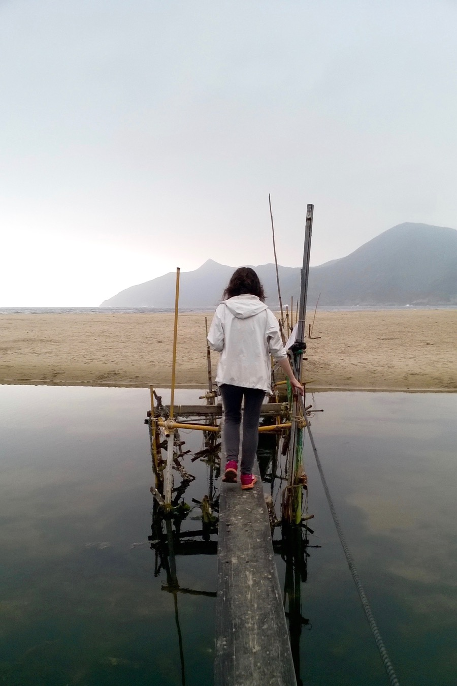
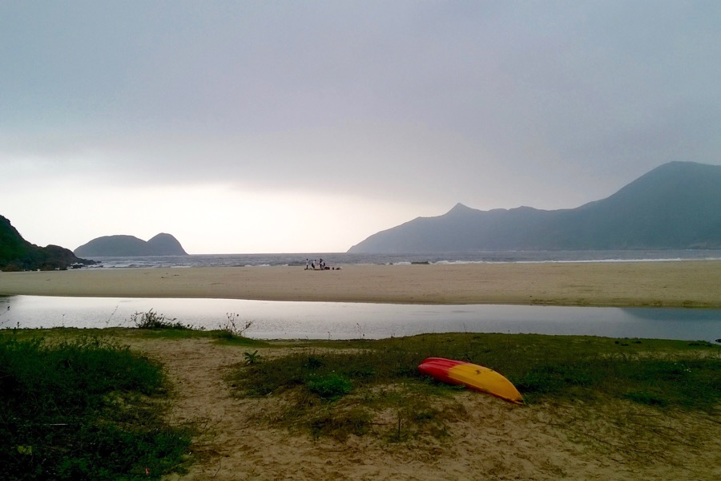

El is felejtettük megírni, hogy a Shanghai – Hong Kong járatra csak 5 kg kézipoggyászt lehetett felvinni. A jó hír, hogy be tudtunk pakolni 8 kg cuccot úgy, hogy a táskáink ne legyenek nehezebbek 5-nél. (Nehéz dolgok zsebbe, ruhák nagy része rajtunk...)

A Shanghai utáni természethiányunk még nem múlt el, úgyhogy ma is túrázni voltunk. A Sai Kung Nemzeti Park egy részét másztuk meg, utunk egy csodaszép öbölbe vezetett.

A trópusi erdő mellett sétálva különös zajokra lettünk figyelmesek a lombkoronából. Ágrecsegés-ropogás, ismeretlen állathangok. Kiderült, hogy igazi majmok voltak!

