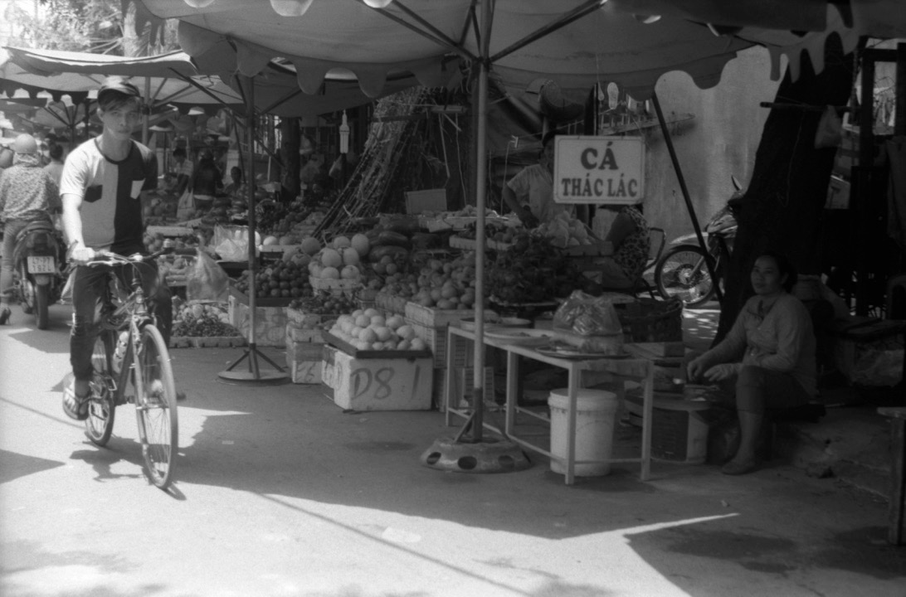

Saigon (Ho Chi Minh város) nyüzsgő metropolisz, mégis egész élhetőnek tűnik. Nekünk a legjobb az volt benne, hogy találkoztunk otthoni jóbarátokkal.

Furcsa és nagyon jó érzés volt a világ másik felén látni egymást. Samu születésnapján egy utcai kifőzdében vacsoráztunk együtt, sört ittunk, és nagyon furcsa, cukros-édes gyümölcssalátát ettünk torta helyett.

Másnap egy parkban próbáltunk menekülni a fülledt hőség elől, árnyas fák alatt, Saigon Special sörök társaságában.
