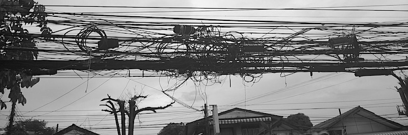

Az utóbbi három napban nem volt internet, tegnap pedig áram sem. Az internethiány eleinte kibírható volt: olvastunk, medencéztünk, sportoltunk az edzőteremben. Három nap után viszont kifejezetten idegesítő volt, hogy nem tudtunk tanulni, kommunikálni, vagy utánanézni bárminek (pl. hogy hogy jutunk ki a szigetről hazafele).

Ilyenkor derül ki, mennyire mindennapos eszköz az internet. Kibírjuk nélküle egy darabig, mint ahogy kibírjuk tiszta víz, fűtés és fedél nélkül, de alapvető emberi jogunk és szükségletünk.

Első nap azt mondták, két óráig tart a kimaradás. Este azt mondták, sajnos csak holnap lesz. Másnap délután még mindig nem volt, viszont __jött egy kis szellő, így az áramellátás is megszűnt__. Harmadnap szemerkélt az eső, ez a természeti csapás tovább nyújtotta a szükségállapotot.

Thaiföldön mégsem ez volt a legrosszabb benyomásunk. Az egyik délután elsétáltunk Chaweng nevű strandra (tömegközlekedés nincs, robogót nem használunk, taxi nagyon drága), és fürödtünk egyet a tengerben. Amikor le akartuk mosni magunkról a ránk száradt sót, megkérdeztük az információs pultnál üldögélő nénit, hogy hol találhatunk zuhanyzót a strandon. Túlzottan nyájasan köszöntött (turistacsapdák jellemzője ez a modor), és amikor megértette a kérdést, közölte, hogy nem tudja, ez nem az ő dolga (_"I don't know, it's not my job. But you can ask those guys at the restaurant."_) Nyilván ha vásárolni akartunk volna, más lett volna a hozzáállása.

Még mindig nincs netünk a szállásunkon, ezt az utca másik oldalán lévő hotel lobbijából írjuk.
