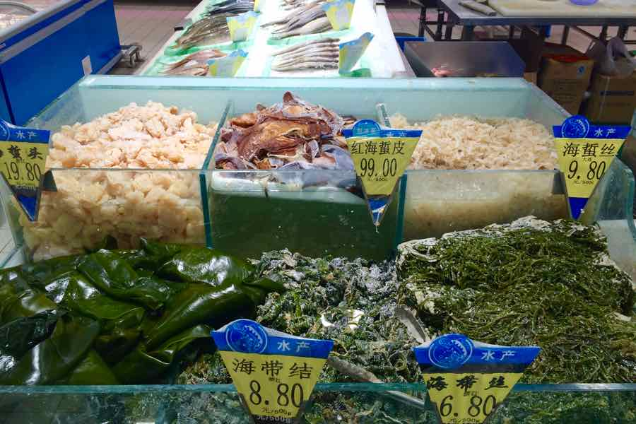
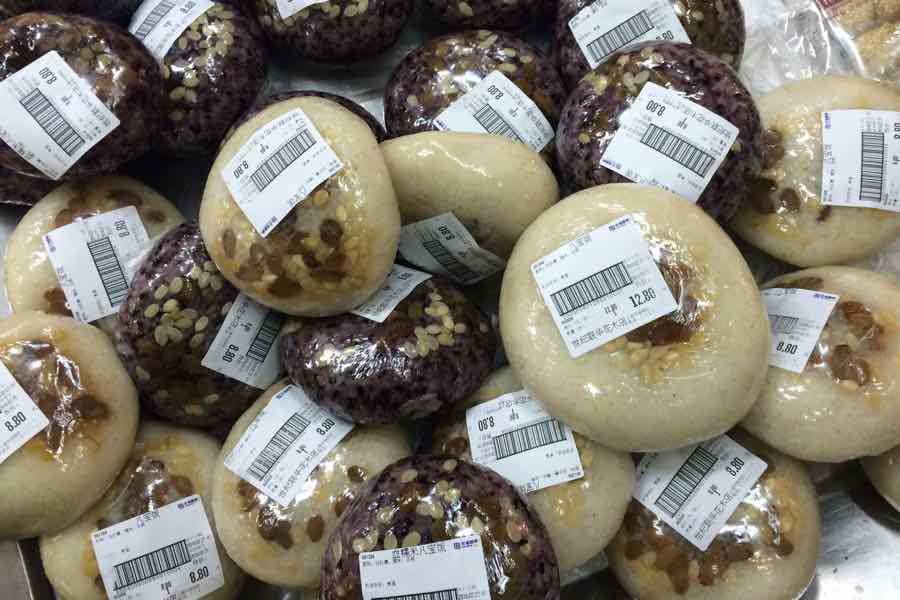
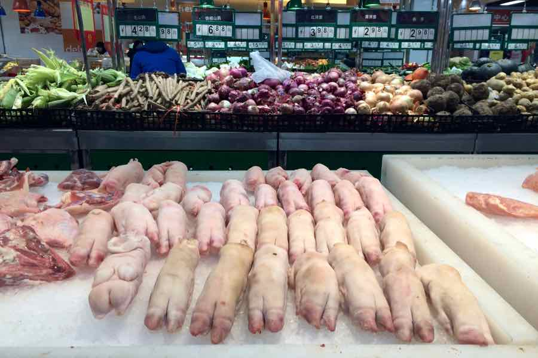
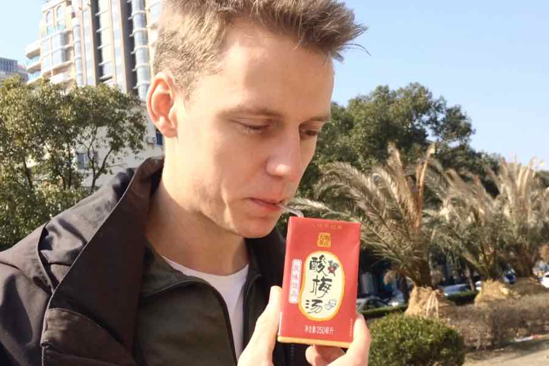
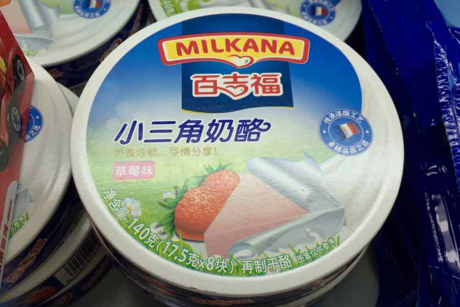

Tegnap elfelejtettük megírni, hogy láttunk egy kövér embert (nem kínai volt).

Ebéd előtt nagyjából kiszótáraztuk a törzshelyünk étlapját. Kiderült, hogy náluk is van angolna, és most már tudjuk, hogy mit nem szabad kérni.

### Napi múzeum helyett

Más országok boltjaiban csavarogni tökéletes nyelvóra (mindenre rá van írva a neve), és még szórakoztató is: miből van sok (...mindenből, de a fél sort elfoglaló fogkrémválaszték azért tényleg nem semmi), miből van kevés — pl. borotvapengét csak a harmadik bolt tartott, a Nescafét meg elzárt üvegszekrényből kellett kérni. De a lényeg, hogy mi van:

Holnap megyünk Nanjingbe két napra, legközelebb szombaton jelentkezünk, de nyugi, nem vesztünk el. :)

Ui.: köszi minden e-mailt, nagyon jólesik olvasni őket!
