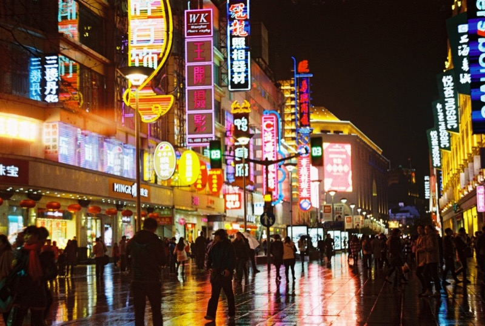
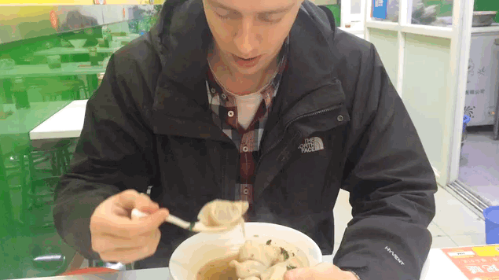

Kialudtuk magunkat, hangulatjelentés! Ma hajnali és délután 3-kor is felkeltünk (utóbbi végülis otthoni reggel 8), bejelentkeztünk a rendőrségen, hogy itt tartózkodunk, aztán ettünk nyársra tűzött kandírozott epret.

Shanghaiban egy nagyon kicsit melegebb van, mint otthon. Az emberek beszélnek hozzánk kínaiul, néha értünk egy kicsit, de lesz ez még jobb is. Viszonylag szenzáció vagyunk (khm.. főleg a magas szőke kettőnk közül), ma egy egész 4 fős társaság egyesével lefotózkodott velünk.

A lakás nagyon jó helyen van (csendes városrész, de jó közlekedéssel, boltokkal, postával, bankkal…), az ágyunk puha, a WC ülőke fűtött (nem vicc), és az első perctől kezdve otthon érezzük magunkat. Érdekes élmény rádöbbeni arra, hogy mennyire hasonlóak is tudnak lenni emberek, lakások a világ két ilyen messzi pontján.

A lakásban körülszaglászva azt tapasztaltuk, hogy számos használati tárgy ugyanaz, mint ami nekünk van otthon. A globalizációnak bizonyára vannak negatív oldalai, de mindenképp érdekes és megnyugtató élmény ugyanazt a poharat, vízforralót, kézisúlyzót, Instax-filmes dobozt látni a Shanghai-i Meihua Road-on, mint 8500 km-re innen, otthon, Budapesten.

A kaja brutálisan jó és olcsó, az adagok hatalmasak, Eszter simán jól lakik úgy, hogy nem látszik meg a tányéron, hogy hozzá nyúlt.

