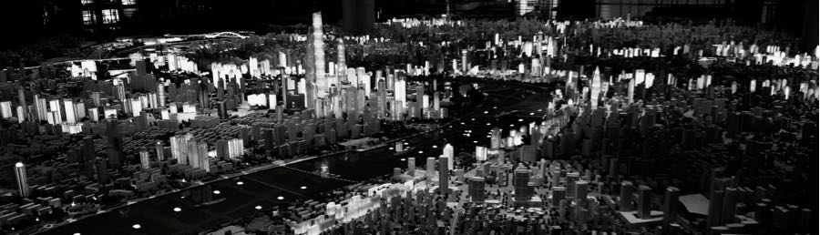
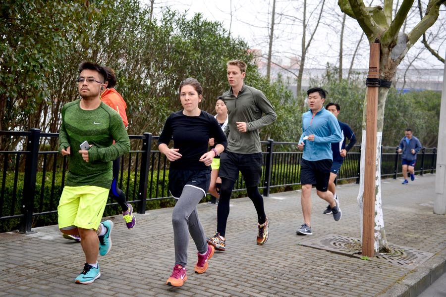
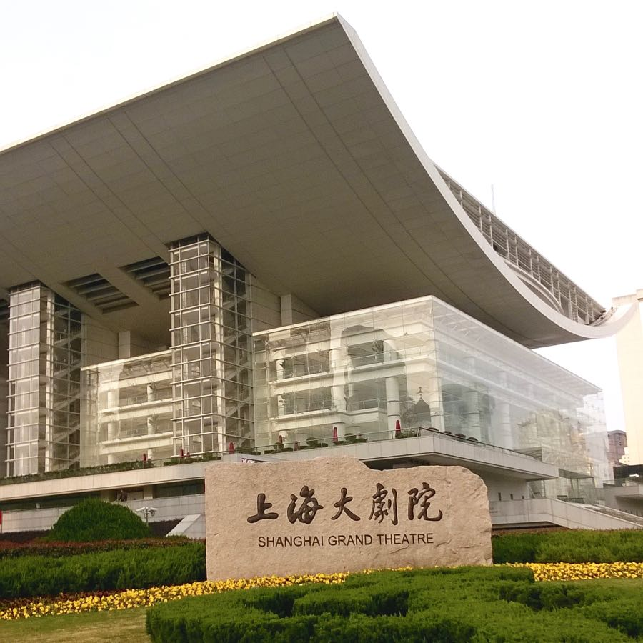

Az elmúlt napokban ilyeneket csináltunk:

- futottunk: a NIKE futóklubban (10 km) és városi futók találkozóján (6x1000m iramfutás)
- mászkáltunk a belvárosban, pl. a francia negyedben<!--more-->
- voltunk városépítészeti kiállításon, ahol többek között egy hatamas, teremnyi makett marhára tetszett
- cukrászdáztunk
- terveztük az utazás további céljait — és nagyjából ki is alakult a terv. Vettünk 6 repülőjegyet.
- lefordítottuk a blogot angolra
- folytattuk online tanulmányainkat.

  

És ilyeneket nem csináltunk:
- nem ittunk jó kávét
- nem lélegeztünk jó levegőt.

