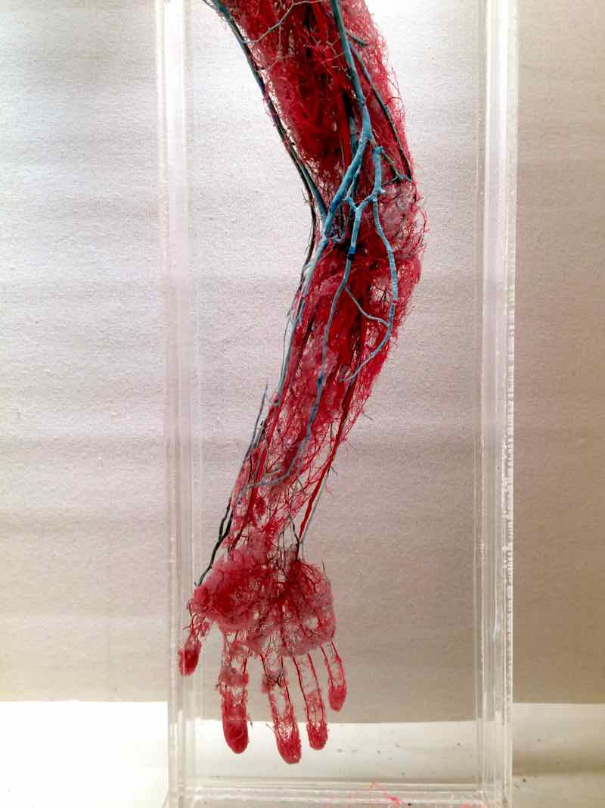
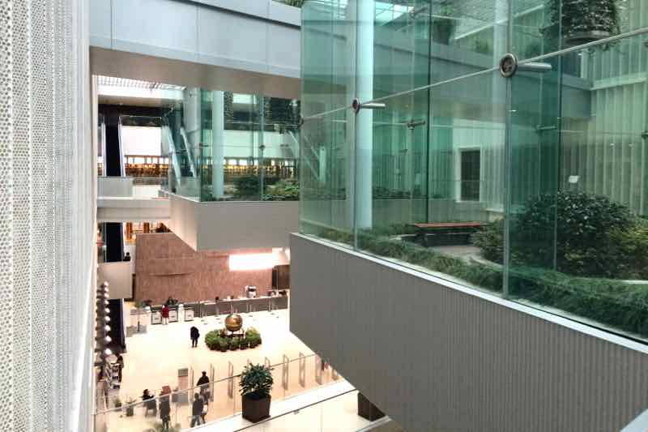

Tegnap randizni voltunk a Starbucksban (ahol Samut Sir-nek szólították, és kivételesen tudtak angolul), így nem írtunk blogot, de ma sokkal inkább. Annyi maradt ki, hogy tegnap sajnos láttunk angolnát a piacon. Ma szürreális múzeumról és nagy terekről lesz szó.

A délelőttöt a __Shanghai Museum of Science and Technology__-ban töltöttük, amiről azt mondták a szállásadóink, hogy inkább gyerekeknek való. Ennek megfelelően remekül éreztük magunkat.

  
  

Egyrészt nagyon jól lehet múzeumban nyelvet tanulni, mert minden kiállított dolog mellé ki van írva kínaiul és angolul, hogy mi az.

Kedvenceink az állatvilágból:

动物 mozgó dolog = állat  
海象 tengeri elefánt = rozmár  
袋鼠 zsebes egér = kenguru  
河马 folyami ló = víziló  
狮 (szőr + mester) = oroszlán.

Másrészt az egész nagyon furcsa élmény volt, egészen komoly dolgok (pl. a kéz teljes érszerkezetének 1:1 modellje), rubik kockát kirakó robot, arrébb hatalmas, középiskolai biológiaórákat idéző műanyagember, aztán klónozott állatokat ábrázoló mű-kitömött állatutánzatok (ilyen alapon mi is nyithatnánk egy kiállítást klónozott állatok rajzaiból).

Az ebédet már kínaiul kértük a kedvenc helyünkön. (Hány látogatás után számít egy étkezde törzshelynek?) Viszonylag azt kaptuk, amire számítottunk, a medvecukornak tűnő valamiket leszámítva. Ez most jó volt.

Délután programozni tanultunk [Courserán](http://coursera.org/) a Pudong könyvtárban.

  
  
  
