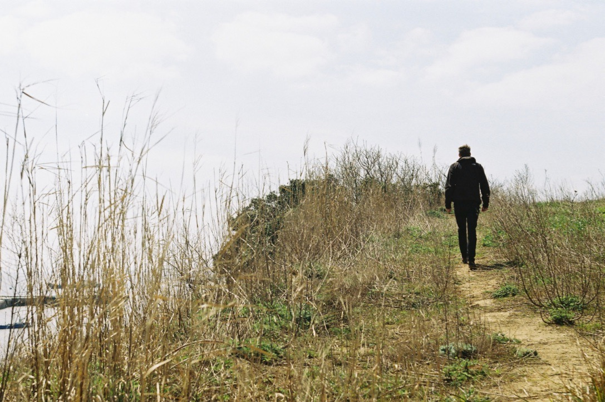
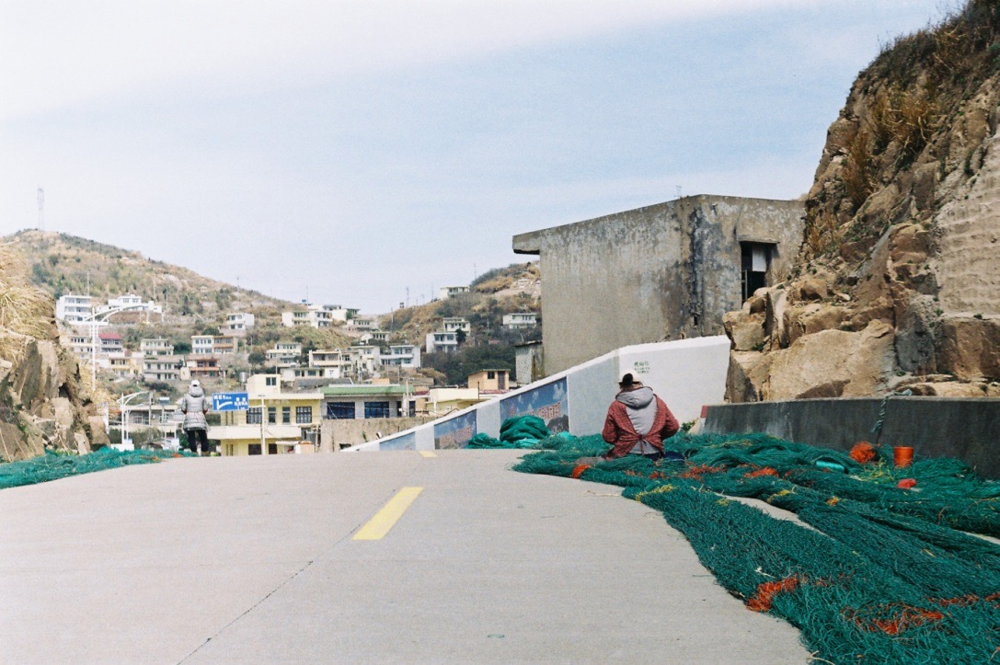
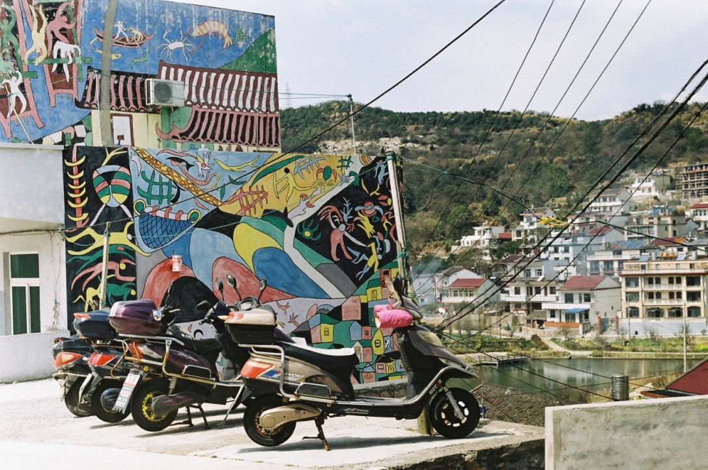

„Hétvégi” kiruccanásunk kedd-szerdára esett: a Shengsi szigetekre mentünk. Valahogy így ejtik: senkszi, ami szerintünk a Senki Szigetének rövidítése.

Már a kompon megismerkedtünk egy kedves helyi angoltanárnővel, úgynevezett „Jane”-nel. Jane még csak 10 napot töltött külföldön életében (nemrég voltak osztálykiránduláson Új-Zélandon), ennek ellenére nagyon szépen beszélt angolul. Ő kezdeményezte a beszélgetést, és hasznos tippeket adott a szigetről.

Igazi halászsziget, halászfalvakkal: hajókalapálás és olajszag a kikötőben, hálófonás és száradó halak és rákok az úttest mellett. A sziget körül szennyes-barna víz volt mindenhol, egyrészt az agyagos talaj, másrészt valószínűleg a rengeteg halászbárka miatt.

Viszont sokkal nyugodtabb, csendesebb és tisztább, mint Shanghai, az itt lakók pedig egytől egyig nagyon nyitottak voltak felénk. Nagyon jó volt kikapcsolódni egy kicsit itt a nagyvárosi zajok után.

A buszon rendszeresen átadták nekünk az ülőhelyet — még Samunak is, mert látták, hogy kényelmetlen behúzott nyakkal állni, lévén a busz gyakorlatilag vállig ért neki. A buszjegy 1 yuan-ba kerül (43 forint).

Amikor megkérdeztünk egy biztos urat (megszólítása: „Shifu”, azaz „Mester”) a buszpályaudvarról, nagyon kedvesen kalauzolt minket, még CB rádión oda is szólt egy kollegájának, hogy figyeljen ránk. Ő egy másik kereszteződésben fogadott minket, és folytatta az útbaigazítást.

Este a hotelben akartunk sörözni, de nem volt sörnyitónk. Amikor Samu lement a recepcióra kérni egyet, azt látta, hogy négy ember, köztük a recepciós hölgy is, az asztalnál görnyed, és valamit átszellemülten vizsgálnak. A mi útlevelünk fényképes oldalait nézegették… nagyon aranyosak voltak. Nyilván érdekesek vagyunk nekik. A szobánkban, sörivás közben még húsz perc múlva is hallottuk, hogy rólunk beszélnek — „Magyarorszáról jöttek! Magyarország!” Nagy szám voltunk nekik.
