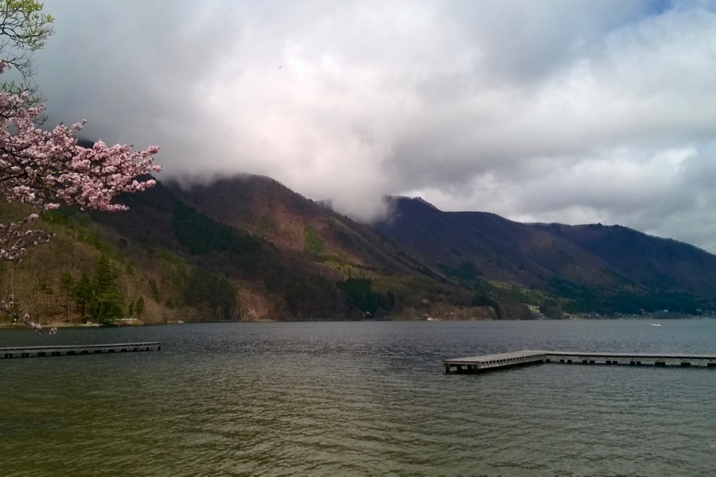

Délelőtt házigazdánk autóval elvitt minket Shinano-Kizakiba, a Kizaki tó déli partjára. A tó mellett sétáltunk egyet, fotóztunk, csodáltuk a tájat és azt, hogy nincs itt senki. Gyönyörű, tiszta vízű tó, körülötte cédruserdő és gyümölcsfák.

## A fürdő

Séta után fürdőházba mentünk. A fürdő: automatából jegyvásárlás, majd a jegy átadása a recepciós hölgynek, férfi és női részleg megtalálása, tolóajtók használatának megfejtése, az öltözőben meztelenre vetkőzés és kis törülközővel belépés a medencetérbe. A medencézés előtt kis sámliknál, tükör előtt alapos szappanos mosdás, majd belépdelés a forróvizes medencébe. A víz elsőre túlzottan forrónak tűnik, mert forróbb, mint otthon bármelyik gyógyfürdő legmelegebb medencéje... 42 fok feletti lehet.

A nagymedence mellett hagyományos szauna, a szauna mögött egy jéghideg merülődézsa. Komoly hidegvíz, bőven 17 fok alatt, nem csak olyan wellness-fürdőkbe illő langyos víz: ennek különösen megörültem, és ekkor éreztem: ez a legjobb fürdő, ahol valaha voltam. A kinti medence, ami szintén forró, de kevésbé kegyetlen, mint a benti, szintén kitűnő: enyhe szél fújja az ember arcát, miközben sziklák között ül a vízben.

Fürdés és szárítkozás után az volt a legnagyobb problémánk, hogy az automatáknál milyen fagylaltot válasszunk a csokistej mellé. Igazi dilemma. Végül narancsos-csokis és mogyorós-csokoládés-ostyás jégkrémeket ettünk.

---

Egy kis séta után megtaláltuk a vasúti megállót. Kicsi, elhagyatott megálló, ember egy szál sem — nem úgy tűnt, mintha itt megállna bármi is. Tíz perc után mégis előtűnt a kanyart takaró cseresznyefák mögül a vonatunk, mi pedig szaladtunk a másik peronra, mert még nem szoktuk meg, hogy a vonatok is a bal oldalon közlekednek...

Matsumoto felé félúton felszállt egy elegáns középkorú házaspár, akik egyből szóbaelegyedtek velünk. Jól beszéltek angolul és a férfi meglehetősen excentrikus volt. Kiderült, egyetemi tanár minőségirányítási területen. Sokat nevetett és dőltek belőle a szóviccek. _“Most Japanese are shy, but I am shiny.”_ Felesége minden vicc után szabadkozott... Érdeklődtek, hogy tetszik Japán, hol voltunk, miket láttunk és miket ettünk... kaptunk tőlük négy pici almás Kit-Katet (a környék állítólag almatermelő vidék). Ők Matsumotoba kirándultak éppen, a kastélyba tartottak.

Az európai Interrail túrákhoz szokott utazó meglepődhet a japán vasút hatékonyságán — teljesen más élmény itt utazni. A sorban állás minimális, a késés nagyon ritka, a vasútállomások tiszták, a vonatok szupergyorsak és kényelmesek. Matsumotóból Tokióba kb. három perc volt lefoglalni a jegyünket, pedig extra kérésünk is volt: Naganóban szeretnénk eltölteni másfél órát. Pár kattintás után a kedves hölgy átadta a megfelelő vonatra szóló helyjegyeket.

Az állomáson betértünk az egyik peronon működő kis kifőzdébe. A háttérben 2500 m magas hegyek állnak, mi pedig kacsamelles tésztalevest eszünk: extra jó élmény.
