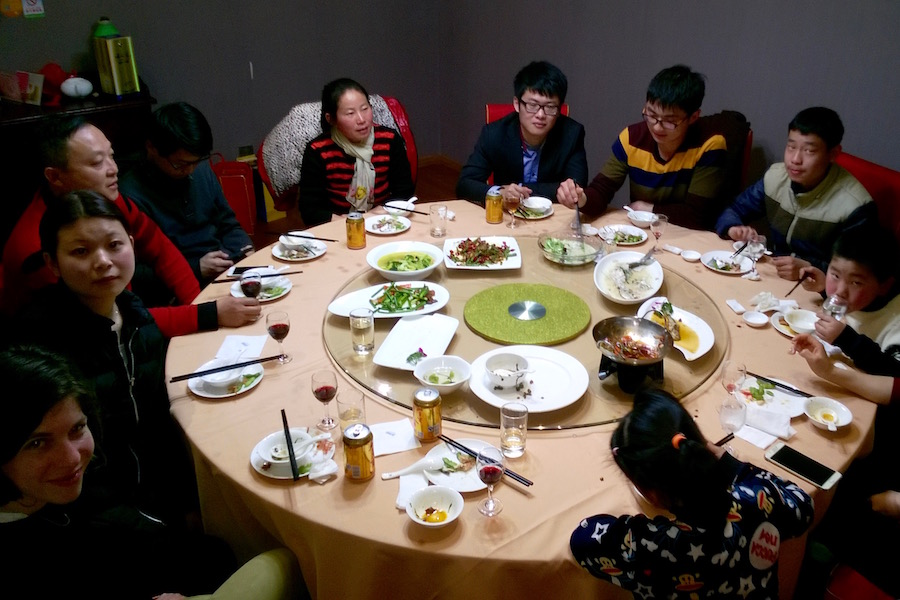

Jól alakult a suzhoui (“szúdzsó”) kirándulásunk. A vonatról megismert lány (nevét nem tudjuk) zavarba ejtően kedves volt. Büszkén mutatott be a családjának, a szülei pedig büszkék voltak, hogy a lányuknak külföldi barátai vannak. Talán mi, nyugati fiatalok testesítjük meg mindazt, amiről egy Shanghai környéki külvárosi fiatal álmodik.

Étterembe hívtak, ahol zsibbasztó-csípős fűszerekben sült halat ettünk, hozzá kókuszlevet és gyógynövényes teát ittunk.

Mindenhova vittek kocsival, semmit sem hagytak kifizetni, még a vonatjegyünket is megvették hazafele, miután kivittek a pályaudvarra.

Többek között kaptunk:
- nyuszifül alakú hajcsatot
- nyuszi alakú nyalókát
- rántott polipgolyókat.

Este a nagycsaláddal vacsoráztunk, szintén étteremben, ami megkoronázta az egyébként is szürreális napot. Jó volt.

