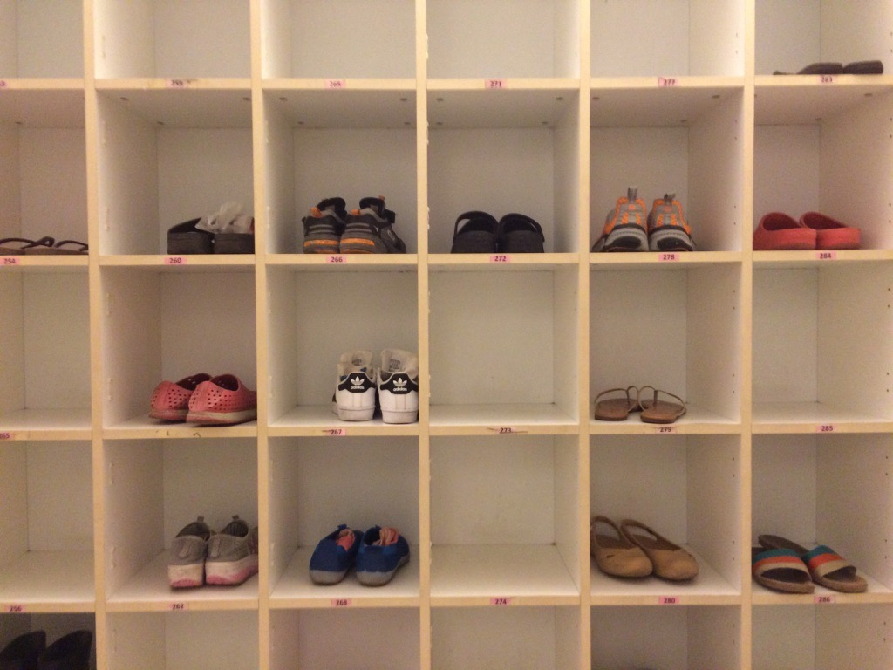
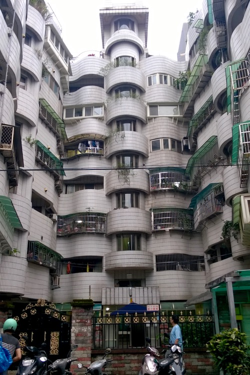
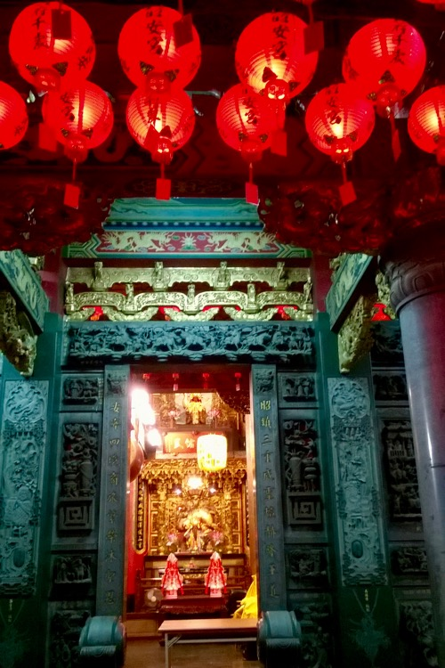

Tegnap délután uszodába mentünk, és ez nagyon jó döntésnek bizonyult. Helyre állt a világ rendje: felfrissültünk az úszástól, gőzkamrától és szaunától, majd kiadósat vacsoráztunk.

Ma szintén sportos napunk volt: futottunk és úsztunk is egy másik uszodában. A kerületi futópálya (szuper minőségű rekortán) este hétkor tele van emberekkel, az uszoda is nagyon jó.

Úszás után kopogott a szemünk, ezért sietve utcai étkezdék után néztünk. Előételünk egy zacskó furcsaság volt: szétfőtt csirkehúst (mellet, szívet) és zöldségeket vágnak apróra, mellé ízlés szerint fürjtojást és pici virsliket tesznek, majd az egészet zacskóba öntik, amiből hosszú fogpiszkálóval eszegeti ki az ember, akár menet közben. Finom. Másodiknak porhanyós-omlós rántott csirkét ettünk, erősen sózva és paprikázva.

A tajvani mandarint meglepően jól megértjük.

