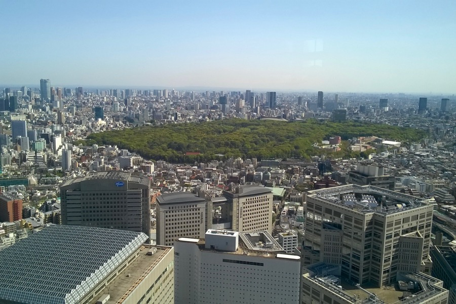

Most épp Tokió a kedvenc városunk. Samu rég óta itt élő nagybátyjának köszönhetően egy kicsit helyi szemmel is betekinthetünk az itteni életbe.

Shimokitazawa például egy barátságos, élettel teli, de nem zsúfolt negyed. Sétálóutcáiban design üzletek, érdekes könyvesboltok, cuki kávézók, bárok és éttermek sorakoznak.

A Tokyo Metropolitan Building-ben 202 m magasan van egy ingyenes kilátó, ahonnan rálátni a Shinjuku negyedre.

