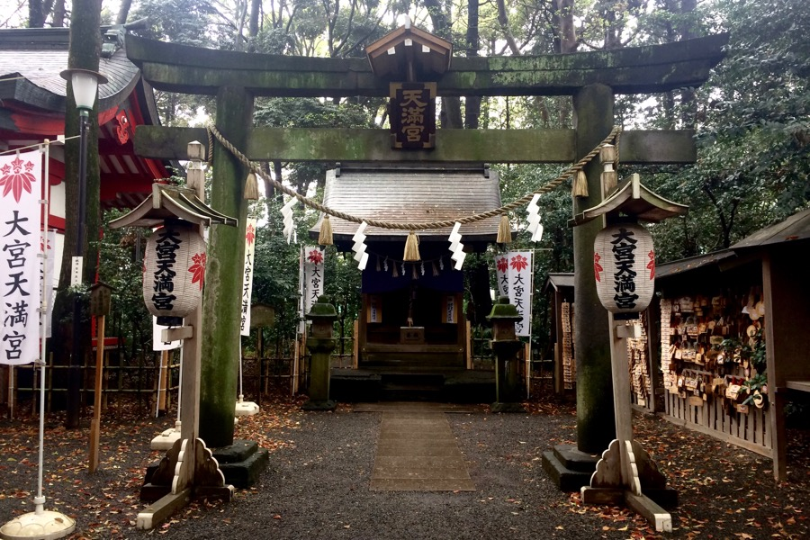
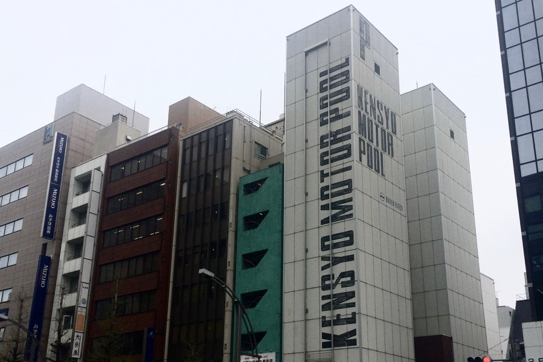
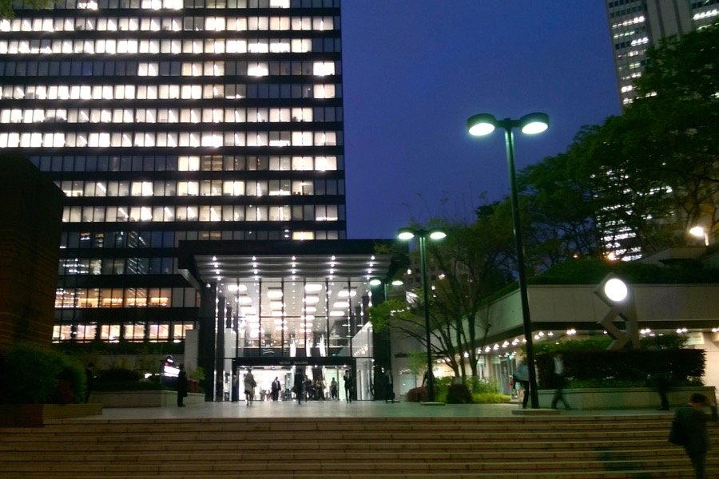
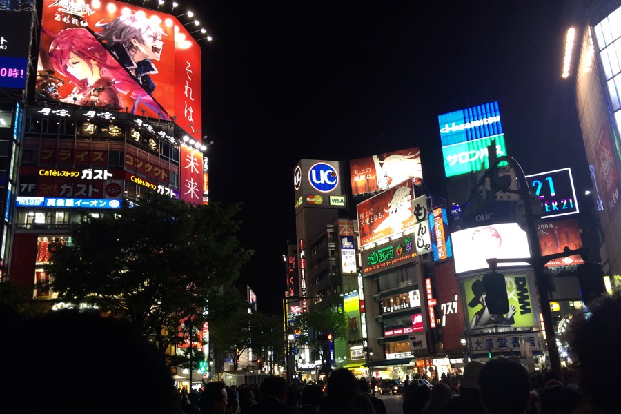
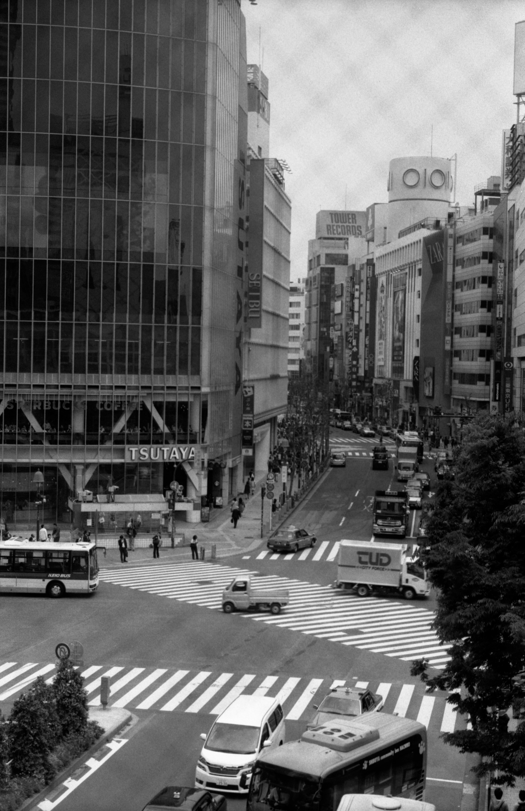
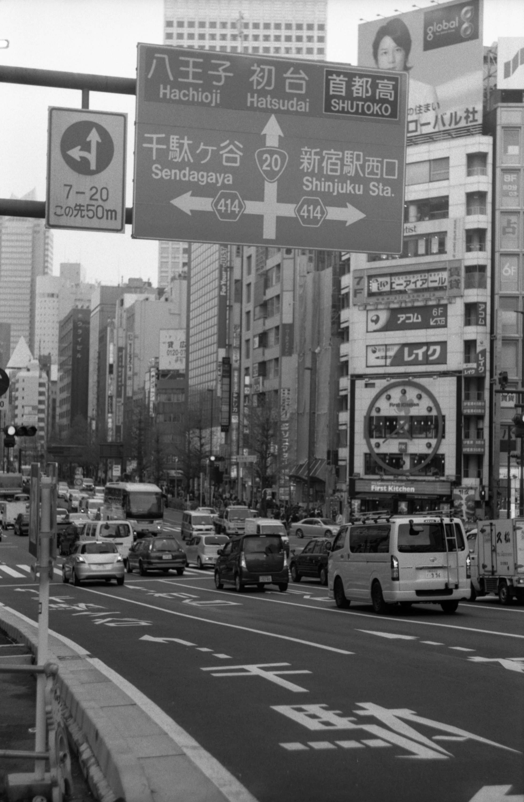
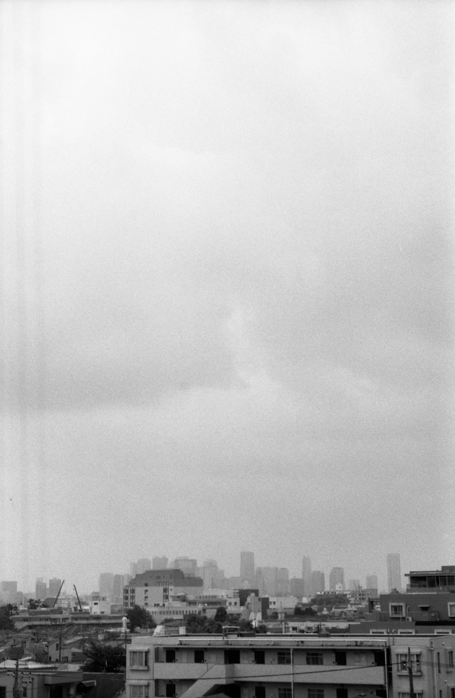

<video src="/video/jp_tokyo.mp4" poster="/video/jp_tokyo.png" autoplay loop>
</video>

Tokió tök jó, és vettünk nyuszis fogkrémet! Autós rágó íze van.

Japánban:
- éreztünk földrengést
- a reptéren az összes gyalogos útvonal futópályából (rekortánból) van
- nincs hangzavar
- minden szép és tiszta
- 70 féle Fanta van
- lehet automatából meleg dobozos kávét venni
- a metrón bemondják, hogy némítsd le a telefonod és ne beszélj, hogy ne zavarj másokat.

Ma sokat sétáltunk Shinjuku környékén, ahol hatalmas futurisztikus épületek vannak. Olyan érzés, mintha nem is térben, hanem időben utaznánk.

